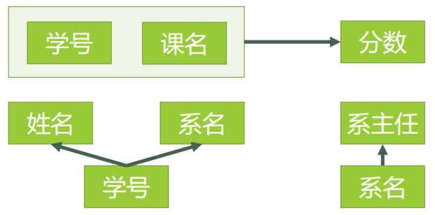
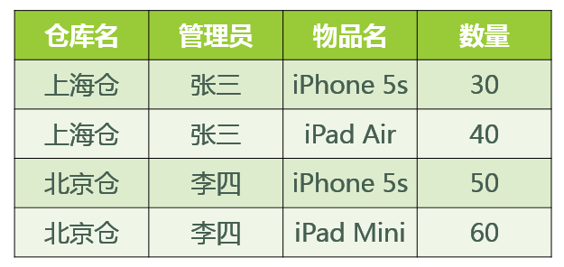

# ❗关系（没整理）

现实中实体与实体间的各种联系均用关系来表示。

### 关系模式

关系模式（Relational Model）是一种在数据库中组织和表示数据的方式。它基于关系理论，使用表格（也称为关系）来存储和表示数据。在关系模型中，数据被组织为行（记录）和列（字段）的二维表格。

关系模式：**（关系模式是型）（关系是值）**

（关系模式是对关系的描述），例如，设有一个关系U有属性值A,B,C，则关系模式可简单描述为为U(A,B,C)

关系模型的核心概念包括：

- 表格（Relation）：表格是关系模型中的基本组织单位，也称为关系。每个表格具有一个唯一的名称，并包含多个列和行。每列代表一个属性或字段，每行代表一个记录或实例。
- 列（Attribute）：列是表格中的一个字段，用于存储特定类型的数据。每个列都有一个名称和数据类型，例如整数、字符串、日期等。
- 行（Tuple）：行是表格中的一个记录，包含了一组相关的数据。每行中的值与对应列的数据类型相匹配。
- 主键（Primary Key）：主键是表格中的一个列或一组列，用于唯一标识每个记录。主键的值在表格中必须是唯一的。
- 外键（Foreign Key）：外键是表格中的一个列，用于建立与其他表格之间的关联关系。它引用了其他表格的主键，用于实现表格之间的关联和关系。

关系模型的使用步骤如下：

1. 根据应用需求和数据特性，确定需要存储的数据和各个数据实体的属性。
2. 设计表格结构，确定每个表格的名称、列和数据类型。确保每个表格有适当的主键和外键定义。
3. 创建数据库，使用数据库管理系统（如MySQL、Oracle、SQL Server等）来创建表格结构。
4. 插入数据，将实际数据插入到相应的表格中。
5. 使用SQL（Structured Query Language）进行数据查询、更新和操作。通过SQL语句可以执行数据的增删改查等操作。

#### 关系和关系模式的联系与区别

联系：**关系模式是对关系的描述，关系是关系模式在某一时刻的状态或内容。关系模式和关系往往笼统称为关系**。

区别：**关系模式是静态的、稳定的，而关系时动态的、随时间不断变化的。**

### 关系数据库

关系数据库：在一个给定的应用领域中，所有关系的集合构成一个关系数据库

关系数据库的型和值：

- 型：关系数据模式，是对关系数据库的描述
- 值：关系模式在某一时刻对应的关系的集合

关系数据库语言分为关系代数、关系演算和结构化查询语言三大类。

### 关系运算

关系的 5 种基本操作是选择、投影、并、差、笛卡尔积。

关系模式是对关系的描述，五元组形式化表示为：R（U，D，DOM，F），其中：

​      R —— 关系名

​      U —— 组成该关系的属性名集合

​      D —— 属性组 U 中属性所来自的域

​      DOM —— 属性向域的映象集合

​      F —— 属性间的数据依赖关系集合

笛卡尔乘积，选择和投影运算如下：

### ❗关系规范化

规范化目的：**减少数据冗余**。

关系数据库中的关系满足一定要求的，满足不同程度要求的为不同的范式。满足最低要求的叫第一范式，简称1NF；在第一范式的基础上满足进一步要求的称为第二范式，简称2NF，其余范式以此类推。

首先要明白”范式（NF）”是什么意思。按照教材中的定义，范式是“符合某一种级别的关系模式的集合，表示一个关系内部各属性之间的联系的合理化程度”。

数据库范式也分为1NF，2NF，3NF，BCNF，4NF，5NF。

一般在我们设计关系型数据库的时候，**最多考虑到BCNF就够**。符合高一级范式的设计，必定符合低一级范式，例如符合2NF的关系模式，必定符合1NF。

*关系模式”和“关系”的区别，类似于面向对象程序设计中”类“与”对象“的区别。”关系“是”关系模式“的一个实例，你可以把”关系”理解为一张带数据的表，而“关系模式”是这张数据表的表结构。*

#### 第一范式 1NF

**定义：**==属于第一范式关系的**所有属性都不可再分的原子值**，即**数据项不可分。**==

**理解：** 第一范式强调数据表的原子性，是其他范式的基础。如下图所示数据库就不符合第一范式：

实际上，**1NF是所有关系型数据库的最基本要求**，你在关系型数据库管理系统（RDBMS），例如SQL Server，Oracle，MySQL中创建数据表的时候，如果数据表的设计不符合这个最基本的要求，那么操作一定是不能成功的。也就是说，只要在RDBMS中已经存在的数据表，一定是符合1NF的。如果我们要在RDBMS中表现表中的数据，就得设计为下表的形式：

但日常生活中仅用第一范式来规范表格是远远不够的，依然会存在数据冗余过大、删除异常、插入异常、修改异常的问题，此时就需要引入规范化概念，将其转化为更标准化的表格，减少数据依赖。

**规范化：** 

1. 每一名学生的学号、姓名、系名、系主任这些数据重复多次。每个系与对应的系主任的数据也重复多次——**数据冗余过大**

2. 假如学校新建了一个系，但是暂时还没有招收任何学生（比如3月份就新建了，但要等到8月份才招生），那么是无法将系名与系主任的数据单独地添加到数据表中去的 （注１）——**插入异常**

   注１：根据三种关系完整性约束中实体完整性的要求，关系中的码（注２）所包含的任意一个属性都不能为空，所有属性的组合也不能重复。为了满足此要求，图中的表，只能将学号与课名的组合作为码，否则就无法唯一地区分每一条记录。

   注２：**码：关系中的某个属性或者某几个属性的组合，用于区分每个元组**（可以把“元组”理解为一张表中的每条记录，也就是每一行）**。**

3. 假如将某个系中所有学生相关的记录都删除，那么所有系与系主任的数据也就随之消失了（一个系所有学生都没有了，并不表示这个系就没有了）。——**删除异常**

4. 假如李小明转系到法律系，那么为了保证数据库中数据的一致性，需要修改三条记录中系与系主任的数据。——**修改异常**。

正因为仅符合1NF的数据库设计存在着这样那样的问题，我们需要提高设计标准，去掉导致上述四种问题的因素，使其符合更高一级的范式（2NF），这就是所谓的“规范化”。

**规范化：** 一个低一级的关系模式通过模式分解可以转化为若干个高一级范式的关系模式的集合，这个过程叫做规范化。

#### 第二范式 2NF

**定义：** ==若某关系R属于第一范式，且每一个非主属性完全函数依赖于任何一个候选码，（**不完全函数依赖**）则关系R属于第二范式。==

此处我们需要理解非主属性、候选码和完全函数依赖的概念。

**候选码：** 

若关系中的某一属性组的值能唯一地标识一个元组，而其子集不能，则称该属性组为候选码。若一个关系中有多个候选码，则选定其中一个为主码。

**以下所有内容中，主码或候选码都简称为码。**

例如下图所示的学生表中，学号和姓名都可以唯一标识一个元组，故该表的候选码为学号和姓名，主码我们可以随便选定其中一个，则选学号为主码。

| 学号 | 姓名   | 年龄 | 性别 |
| :--- | :----- | :--- | :--- |
| 101  | 刘晨   | 19   | 女   |
| 102  | 王琪   | 21   | 男   |
| 103  | 张宇   | 20   | 男   |
| 104  | 李琛   | 19   | 女   |
| 105  | 欧阳慧 | 20   | 女   |

**主属性：** 

所有候选码的属性称为主属性。不包含在任何候选码中的属性称为非主属性或非码属性。

在上面的学生表中，学号和姓名就是该关系的主属性，年龄和性别就是非主属性。

##### 数据依赖

是一个关系内部属性与属性之间的一种约束关系，这种约束关系是通过属性间值得相等与否体现出来的数据间相关联系。数据依赖中最重要的是函数依赖和多值依赖。

##### 函数依赖

设R(U)是属性集U上的关系模式，X、Y是U的子集。若对于R(U)的任意一个可能的关系r，r中不可能存在两个元组在X上的属性值相等，而在Y上的属性值不等，则称Y函数依赖于X或X函数确定Y。

###### 最小函数依赖集

[关系数据库理论之最小函数依赖集-CSDN博客](https://blog.csdn.net/mgsky1/article/details/89061365)

为什么需要最小函数依赖集

在关系数据模型中，一个关系通常由R(U,F)构成，U为属性的全集，F为函数依赖集。在实际生活中，我们可以根据语义来定义关系中属性的依赖关系，例如学号可以唯一确定一位学生的姓名、性别等等。但是，有时候给出的函数依赖集并不是最简的，这有时会拖累我们对关系的后续处理，例如关系的分解、判断是否为无损分解等。所以，我们在必要时，需要对函数依赖集进行化简，这就是需要最小函数依赖集的原因。
在正式介绍最小函数依赖集之前，还需要了解一个概念，那就是闭包。准确的说是属性集X关于函数依赖集F的闭包。

闭包

闭包分为两种，一种是函数依赖集F的闭包，另外一种是属性集X关于函数依赖集F的闭包。前者不做讨论，重点说说后者。

说白了，就是给定属性集X，根据现有的函数依赖集，看其能推出什么属性。
这里的Armstrong公理系统不用深究，想具体了解的可以点击查看百度百科。

最小函数依赖集

定义：如果函数依赖集F满足下列条件，则称F为一个极小函数依赖集，亦称为最小依赖集或最小覆盖。
(1)、F中任一函数依赖右部仅含有一个属性。
(2)、F中不存在这样的函数依赖 $X→ \rightarrow→A$，使得F与$F-{X→ \rightarrow→A}$ 等价。
(3)、F中不存在这样的函数依赖X→ \rightarrow→A，X有真子集Z使得$F-{X→ \rightarrow→A}⋃{Z→ \rightarrow→A}$与F等价。

解释：

以上定义翻译成大白话就是，一个函数依赖集F要想称为最小函数依赖集，要满足以下三点：
1、F中任一函数依赖的右边只有一个属性。
2、F中不存在这样的函数依赖：从现有的函数依赖集中删除一个函数依赖X→ \rightarrow→A，删除后所得的函数依赖集与原来的函数依赖集等价，这样的函数依赖是不允许存在的。
3、F中不存在这样的函数依赖：假设函数依赖集中存在AB→ \rightarrow→Y，现对该依赖的左部进行化简，即删除A，得B→ \rightarrow→Y；或删除B，得A→ \rightarrow→Y，若经过化简后的函数依赖集与没有化简前的函数依赖集等价，那么这样的函数依赖是不允许存在的。

##### ❗部分、完全函数依赖

设R(U)是属性集U上的关系模式，X、Y是U的子集。如果Y函数依赖于X，且对于X的任何一个真子集X’，都有Y不函数依赖于X’，则称Y对X完全函数依赖。记作：如果Y函数依赖于X，但Y不完全函数依赖于X，则称Y对X**部分函数依赖**。

##### ❗传递依赖

**理解：** 第二范式是指每个表必须有一个（有且仅有一个）数据项作为关键字或主键（primary key），其他数据项与关键字或者主键一一对应，即其他数据项完全依赖于关键字或主键。由此可知单主属性的关系均属于第二范式。

- **判断一个关系是否属于第二范式：**

1. 找出数据表中的所有码；
2. 找出所有主属性和非主属性；
3. 判断所有的非主属性对码的部分函数依赖。

**图**表示了表中所有的函数依赖关系：

码只有一个，就是**（学号、课名）**。
主属性有两个：**学号** 与 **课名**
非主属性有四个：**姓名**、**系名**、**系主任**、**分数**
对于**（学号，课名） → 姓名**，有 **学号 → 姓名**，存在非主属性 **姓名** 对码**（学号，课名）**的部分函数依赖。
对于**（学号，课名） → 系名**，有 **学号 → 系名**，存在非主属性 系**名** 对码**（学号，课名）**的部分函数依赖。
对于**（学号，课名） → 系主任**，有 **学号 → 系主任**，存在非主属性 对码**（学号，课名）**的部分函数依赖。

所以存在非主属性对于码的部分函数依赖，最高只符合1NF的要求，不符合2NF的要求。

- **改进：**

为了符合2NF的要求，我们必须消除这些部分函数依赖，只有一个办法，就是将大数据表拆分成两个或者更多个更小的数据表，在拆分的过程中，要达到更高一级范式的要求，这个过程叫做”模式分解“。模式分解的方法不是唯一的，以下是其中一种方法：
选课（学号，课名，分数）
学生（学号，姓名，系名，系主任）

我们先来判断以下，**选课**表与**学生**表，是否符合了2NF的要求？

对于**选课**表，其码是**（学号，课名）**，主属性是**学号**和**课名**，非主属性是**分数**，**学号**确定，并不能唯一确定**分数**，**课名**确定，也不能唯一确定**分数**，所以不存在非主属性**分数**对于码 **（学号，课名）**的部分函数依赖，所以此表符合2NF的要求。

对于**学生**表，其码是**学号，**主属性是**学号**，非主属性是**姓名、系名**和**系主任**，因为码只有一个属性，所以不可能存在非主属性对于码 的部分函数依赖，所以此表符合2NF的要求。

**图**表示了模式分解以后的新的函数依赖关系

下表表示了模式分解以后新的数据

现在我们来看一下，进行同样的操作，是否还存在着之前的那些问题？

1. 李小明转系到法律系
   只需要修改一次李小明对应的系的值即可。——有改进
2. 数据冗余是否减少了？
   学生的姓名、系名与系主任，不再像之前一样重复那么多次了。——有改进
3. 删除某个系中所有的学生记录
   该系的信息仍然全部丢失。——无改进
4. 插入一个尚无学生的新系的信息。
   因为学生表的码是学号，不能为空，所以此操作不被允许。——无改进

所以说，仅仅符合2NF的要求，很多情况下还是不够的，而出现问题的原因，在于仍然存在非主属性**系主任**对于码**学号**的传递函数依赖。为了能进一步解决这些问题，我们还需要将符合2NF要求的数据表改进为符合3NF的要求。

#### 第三范式 3NF（至少）

**定义：**==**非主属性既不传递依赖于码，也不部分依赖于码。**==

**理解：** 第三范式要求在满足第二范式的基础上，任何非主属性不依赖于其他非主属性，即在第二范式的基础上，消除了传递依赖。

接下来我们看看上表中的设计，是否符合3NF的要求。

对于**选课**表，主码为（学号，课名），主属性为**学号**和**课名，**非主属性只有一个，为分数，不可能存在传递函数依赖，所以**选课**表的设计，符合3NF的要求。

对于**学生**表，主码为**学号**，主属性为**学号**，非主属性为**姓名**、**系名**和**系主任**。因为 学号 → 系名，同时 系名 → 系主任，所以存在非主属性**系主任**对于码**学号**的传递函数依赖，所以**学生**表的设计，不符合3NF的要求。。

- **改进**

为了让数据表设计达到3NF，我们必须进一步进行模式分解为以下形式：
选课（学号，课名，分数）
学生（学号，姓名，系名）
系（系名，系主任）

对于**选课**表，符合3NF的要求，之前已经分析过了。

对于**学生**表，码为**学号**，主属性为**学号**，非主属性为**系名**，不可能存在非主属性对于码的传递函数依赖，所以符合3NF的要求。

对于**系**表，码为**系名**，主属性为**系名**，非主属性为**系主任**，不可能存在非主属性对于码的传递函数依赖（至少要有三个属性才可能存在传递函数依赖关系），所以符合3NF的要求。。

新的函数依赖关系如图

新的数据表如下表

现在我们来看一下，进行同样的操作，是否还存在着之前的那些问题？

1. 删除某个系中所有的学生记录
   该系的信息不会丢失。——有改进
2. 插入一个尚无学生的新系的信息。
   因为系表与学生表目前是独立的两张表，所以不影响。——有改进
3. 数据冗余更加少了。——有改进

- **结论**

由此可见，符合3NF要求的数据库设计，**基本**上解决了数据冗余过大，插入异常，修改异常，删除异常的问题。当然，在实际中，往往为了性能上或者应对扩展的需要，经常 做到2NF或者1NF，但是作为数据库设计人员，至少应该知道，3NF的要求是怎样的。

#### BC范式 BCFN

**定义：** 关系模式R<U,F>中，若每一个决定因素都包含码，则R<U,F>属于BCFN。

**理解：** 根据定义我们可以得到结论，一个满足BC范式的关系模式有：

1. 所有非主属性对每一个码都是完全函数依赖；
2. 所有主属性对每一个不包含它的码也是完全函数依赖；
3. 没有任何属性完全函数依赖于非码的任何一组属性。

要了解 BCNF 范式，那么先看这样一个问题：

1. 某公司有若干个仓库；
2. 每个仓库只能有一名管理员，一名管理员只能在一个仓库中工作；
3. 一个仓库中可以存放多种物品，一种物品也可以存放在不同的仓库中。每种物品在每个仓库中都有对应的数量。

那么关系模式 仓库（仓库名，管理员，物品名，数量） 属于哪一级范式？

答：已知函数依赖集：仓库名 → 管理员，管理员 → 仓库名，（仓库名，物品名）→ 数量
码：（管理员，物品名），（仓库名，物品名）
主属性：仓库名、管理员、物品名
非主属性：数量
∵ 不存在非主属性对码的部分函数依赖和传递函数依赖。∴ 此关系模式属于3NF。

基于此关系模式的关系（具体的数据）可能如图所示：

好，既然此关系模式已经属于了 3NF，那么这个关系模式是否存在问题呢？我们来看以下几种操作：

1. 先新增加一个仓库，但尚未存放任何物品，是否可以为该仓库指派管理员？——不可以，因为物品名也是主属性，根据实体完整性的要求，主属性不能为空。
2. 某仓库被清空后，需要删除所有与这个仓库相关的物品存放记录，会带来什么问题？——仓库本身与管理员的信息也被随之删除了。
3. 如果某仓库更换了管理员，会带来什么问题？——这个仓库有几条物品存放记录，就要修改多少次管理员信息。

从这里我们可以得出结论，在某些特殊情况下，即使关系模式符合 3NF 的要求，仍然存在着插入异常，修改异常与删除异常的问题，仍然不是 ”好“ 的设计。

- **改进**

造成此问题的原因：存在着**主属性**对于码的部分函数依赖与传递函数依赖。（在此例中就是存在主属性【仓库名】对于码【（管理员，物品名）】的部分函数依赖。

解决办法就是要在 3NF 的基础上消除**主属性**对于码的部分与传递函数依赖。

仓库（仓库名，管理员）
库存（仓库名，物品名，数量）

这样，之前的插入异常，修改异常与删除异常的问题就被解决了。

以上就是关于 BCNF 的解释。

#### 第四范式 4NF

**定义：** 限制关系模式的属性之间不允许有非平凡且非函数依赖的多值依赖。

**理解：** 显然一个关系模式是4NF，则必为BCNF。也就是说，当一个表中的非主属性互相独立时（3NF），这些非主属性不应该有多值，若有多值就违反了4NF。

#### 第五范式 5NF

第五范式有以下要求：

1. 必须满足第四范式；
2. 表必须可以分解为较小的表，除非那些表在逻辑上拥有与原始表相同的主键。

第五范式是在第四范式的基础上做的进一步规范化。第四范式处理的是相互独立的多值情况，而第五范式则处理相互依赖的多值情况。

#### 总结

第一范式（1NF）：如果一个关系模式R的所有属性都是不可分的基本数据项，则R为第一范式。（也就是不能出现表中表的情况，不满足第一范式则就不是关系数据库）。

第二范式（2NF）：关系模式R是第一范式，并且每一个非主属性都完全函数依赖于R的码，则R为第二范式。消除了非主属性对候选码的部分依赖。

第三范式（3NF）：关系模式R的每一个非主属性既不部分函数依赖于候选码也不传递函数依赖于候选码。显然R也属于第二范式。

BC范式（BCNF）：R属于第一范式，如果对于R的每个函数依赖X->Y，并且Y不包含于X，则X必含有候选码，那么R属于BCNF（即R中的每一个决定因素都包含候选码）

1. BC范式既检查非主属性，又检查主属性。当只检查非主属性时，就成了第三范式。满足BC范式的关系都必然满足第三范式。
2. 符合3NF，并且，主属性不依赖于主属性。
3. 所有非主属性都完全函数依赖于每个候选码。
4. 所有主属性都完全函数依赖于每个不包含它的候选码。
5. 没有任何属性完全函数依赖于非码的任何一组属性。

第四范式（4NF）：消除了多值依赖。

---

