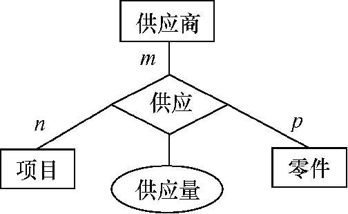
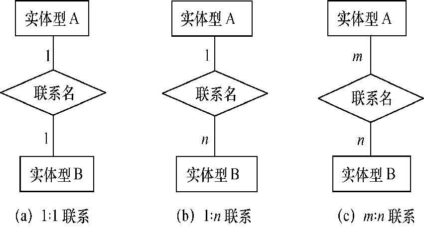
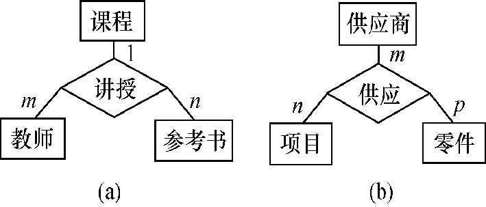
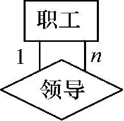
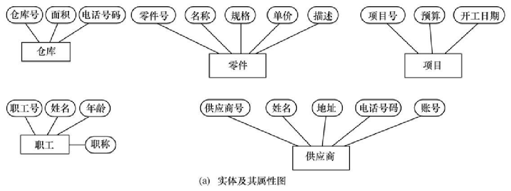
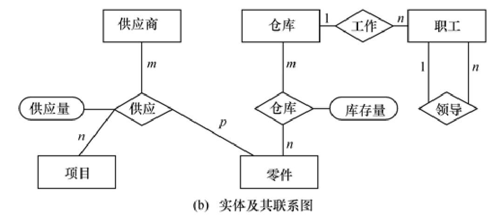
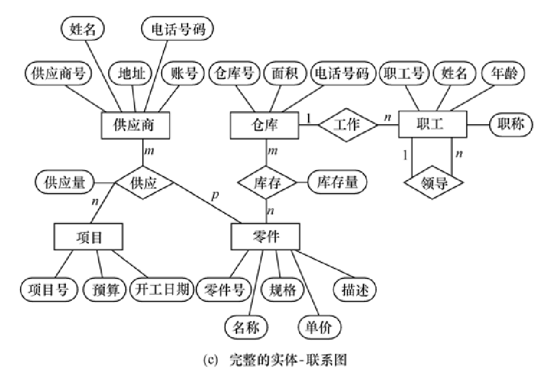

# 二、数据库设计

数据库设计是指对于一个给定的应用环境，构造（设计）优化的数据库逻辑模式和物理结构，并据此建立数据库及其应用系统，使之能够有效地存储和管理数据，满足各种用户的应用需求，包括信息管理要求和数据操作要求。

**数据库设计的目标**：是为用户和各种应用系统提供一个信息基础设施和高效率的运行环境 。

**数据库设计的基本任务**：是根据用户的信息需求、处理需求和数据库的支持环境（包括硬件、操作系统和DBMS），设计出数据库模式（包括外模式、逻辑模式和内模式）及其典型的应用程序。

### ❗1.设计方法

**直观设计法（手工试凑发）**：数据库设计只是一种经验的反复实施，而不能称为是一门科学，缺乏科学分析理论基础和工程手段的支持，因为设计质量与设计人员的经验和水平有直接关系，所以设计质量很难保证。具有周期短、效率高、操作简便、易于实现等优点。主要是用于简单小型系统。

**规范设计法**：将数据库设计分为若干阶段，明确规定各阶段的任务，采用“自顶向下、分层实现、逐步求精”的设计原则，结合数据库理论和软件工程设计方法，实现设计过程的每一细节，最终完成整个设计任务。（新奥尔良方法、基于E-R模型的数据库设计方法、基于3NF（第三范式）的设计方法、面向对象的数据库设计方法、统一建模语言（UML）方法）。

**计算机辅助设计法**：在数据库设计的某些过程中，利用计算机和一些辅助设计工具，模拟某一规范设计方法，并以人的知识或经验为主导，通过人机交互方式实现设计中的某些部分。 （Oracle 公司开发的 Designer、Sybase公司开发的 PowerDesigner）。

### 2.数据库设计的基本步骤

1. **需求分析**：通过详细调查现实世界要处理的对象（组织、部门、企业等），充分了解原系统（手工系统或计算机系统）工作概况，明确用户的各种需求。编写软件规格说明书及初步的用户手册，提交评审。
   1：调查分析用户活动；
   2：收集和分析需求数据，确定系统边界信息需求，处理需求，安全性和完整性需求；
   3：编写系统分析报告。
2. **概念结构设计**：通过对用户需求进行综合、归纳与抽象，形成一个独立于具体数据库管理系统的概念模型。**建立E-R图**。
   1、需求分析数据；
   2、局部E-R模型；
   3、全局E-R模型。
3. **逻辑结构设计**：将概念结构转换为某个数据库管理系统所支持的数据模型，并对其进行优化。主要是**E-R转换成关系模式**（或者说是建立关系模式的阶段）。
   1、初始关系模式设计；
   2、关系模式规范化；
   3：模式评价。
4. **物理结构设计**：为逻辑数据结构选取一个最适合应用环境的物理结构,包括存储结构和存取方法。
   1、确定物理结构；
   2、评价物理结构
5. **数据库实施**：根据逻辑设计和物理设计的结果构建数据库,编写与调试应用程序,组织数据入库并进行试运行。
   1、建立实际数据库结构；
   2、装入数据；
   3、数据库试运行；
   4、应用程序编码与调试；
   5、整理文档。
6. **数据库运行和维护**：经过试运行后即可投入正式运行,在运行过程中必须不断对其进行评估、调整与修改。
   1、维护数据库的安全性和完整性；
   2、监测并改善数据库性能；
   3、重新组织和构造数据库。

注意：需求分析和概念设计独立于任何数据库管理系统。逻辑设计和物理设计与选用的数据库管理系统密切相关

| 设计阶段         | 数据                                     | 处理                                       |
| ---------------- | ---------------------------------------- | ------------------------------------------ |
| 需求分析         | 数据字典、数据项、数据流、数据存储的描述 | 数据流图和判定树、数据字典中处理过程的描述 |
| **概念**结构设计 | 概念模型(ER图)、数据字典                 | 系统说明书(系统要求、方案、概图、数据流图) |
| **逻辑**结构设计 | 某种数据模型(如关系)                     | 系统结构图(模块结构)                       |
| 物理结构设计     | 存储安排、方法选择、存取路径建立         | 模块设计                                   |
| 实施             | 编写模式、装入数据、数据库试运行         | 程序编码、编译联结、测试                   |
| 运行维护         | 性能监测、转储、恢复、数据库重组和重构   | 新旧系统转换、运行、维护                   |

### 一、需求分析

#### 1.需求分析及其任务

**需求分析就是分析用户的需求**：是设计数据库的起点，结果是否准确地反映了用户的实际要求，将直接影响到后面各个阶段的设计，并影响到设计结果是否合理和实用。

**需求分析的任务**：由数据库设计人员和用户双方共同收集信息需求和处理需求；通过仔细分析；将这些需求按一定的规范要求以用户和设计人员都能理解接受的文档形式确定下来。

#### 2.需求分析的方法

需求分析的三个步骤：

1. **需求调查**：收集需求信息, 调查清楚用户的实际要求, 与用户达成共识。
2. **分析、整理和表达这些需求信息，形成需求说明书**（例如，包括DFD和DD等）。
3. **评审**：由主管部门和专家评价、审批。

#### 3.需求调查

##### 3.1需求调查的目的

主要是了解企业的组织机构设置, 各个组织机构的职能、工作目标、职责范围，主要业务活动及大致工作流程，获得各个组织机构的业务数据及其相互联系的信息，为分析整理工作做好前期基础工作。

##### 3.2需求调查的内容

- 组织机构的情况:  组成, 职责, 作用, 现状, 问题，哪些业务适合计算机管理, 哪些不适合。

- 各个部门的业务活动现状(调查的重点):  输入和使用的数据, 加工处理方法, 数据的流程, 输出的数据及格式, 注意收集原始数据资料, 如台帐、单据、发票、收据、统计报表、文档、档案等。

- 外部要求：调查数据处理的响应时间、频度和如何发生的规则，以及经济效益的要求，安全性和完整性的要求。

- 协助用户明确对新系统的各种要求(调查的又一个重点): 信息要求, 处理要求, 安全性要求, 完整性要求, 未来规划中对数据的应用需求等。

- 确定新系统的边界: 哪些由计算机完成, 哪些由人工完成。

##### 3.3需求调查的步骤

1. 调查组织机构情况。

2. 调查各部门的业务活动情况。

3. 协助用户明确对新系统的各种要求，包括信息要求、处理要求、完全性与完整性要求。

4. 确定新系统的边界。

##### 3.4需求调查的方式

- 跟班作业：通过亲身参加业务工作了解业务活动的情况。

- 开调查会：通过与用户座谈来了解业务活动情况及用户需求。

- 请专人介绍。

- 询问：对某些调查中的问题，可以找专人询问。

- 设计调查表请用户填写：调查表设计合理，则很有效。

- 查阅记录：查阅与原系统有关的数据记录。

##### 3.5需求调查策略

- 对高层负责人的调查：一般采用个别交谈方式, 先给一份详细的调查提纲, 以便有所准备。
- 对中层管理人员的调查：可采用开座谈会, 个别交谈, 发调查表, 查阅记录的调查方式。
- 对基层业务人员的调查：主要采用发调查表, 个别交谈或跟班作业的调查方式。

#### 4.分析整理

##### 4.1分析整理的工作

1. 业务流程分析和表示

目的是获得业务流程及业务与数据联系的形式描述。

采用数据流层次结构分析法(SA法)。

分析结果以数据流图(DFD图)表示, 再辅以数据字典(DD)作补充描述。

2. 需求信息的补充描述

数据字典: 主要用于概念结构设计。

业务活动清单: 列出每一部门中最基本的工作任务。

其他需求清单: 如完整性、安全性、一致性要求。

3. 撰写需求分析说明书

##### 4.2分析整理的方法

**结构化分析方法（SA方法）**

SA方法从最上层的系统组织机构入手，采用自顶向下、逐层分解的方式分析系统。

SA步骤：

1. 先把任何一个系统都抽象为**数据流图（DFD图）**形式。
2. 然后从最上层的系统组织机构入手，采用自顶向下，逐步分解，逐步求精的方式分析系统，获得多层DFD图。

**数据流图（DFD）**

[软件工程：可行性研究_并非任何问题都有简单明显的解决方法-CSDN博客](https://shao12138.blog.csdn.net/article/details/109103706?ydreferer=aHR0cHM6Ly9ibG9nLmNzZG4ubmV0L3FxXzQyMTkyNjkzL2FydGljbGUvZGV0YWlscy8xMDk3MjA5NDA%3D)

**数据字典（DD）**

[软件工程：可行性研究_并非任何问题都有简单明显的解决方法-CSDN博客](https://shao12138.blog.csdn.net/article/details/109103706#t4)

### ❗二、概念结构设计

#### 1.概念模型

**概念结构设计**：将需求分析得到的用户需求抽象为信息结构（即概念模型）的过程。

目前应用最普遍的是实体关系（E-R）模型，它将现实世界的信息结构统一用属性、实体以及它们之间的联系来描述。

特点：

- 能真实、充分地反映现实世界，是现实世界的一个真实模型。
- 易于理解，从而可以用它和不熟悉计算机的用户交换意见。
- 易于更改，当应用环境和应用要求改变时，容易对概念模型修改和扩充。
- 易于向关系、网状、层次等各种数据模型转换

#### 2.E-R概念模型

**E-R方法概述：** E-R方法，由P.P.S.Chen于1976年提出，是一个著名且实用的概念设计方法。这种方法通过属性、实体及实体间的联系（E-R图）描述现实世界的信息结构。

[数据库：实体关系图（ER图）_数据库实体关系图-CSDN博客](https://shao12138.blog.csdn.net/article/details/103659528)

E-R图提供了表示实体型、属性和联系的方法

- **实体**：用矩形表示，矩形框内写明实体名。
- **属性**：用椭圆形表示，并用无向边将其与相应的实体型连接起来。
- **联系**：用菱形表示，菱形框内写明联系名，并用无向边分别与有关实体型连接起来，同时在无向边旁标上联系的类型（1∶1，1∶n或m∶n）。（联系可以具有属性）。

##### 2.1实体之间的联系

1. 一对一联系（1∶1）
   如果对于实体集A中的每一个实体，实体集B中至多有一个（也可以没有）实体与之联系，反之亦然，则称实体集A与实体集B具有一对一联系，记为1∶1。

2. 一对多联系（1∶n）
   如果对于实体集A中的每一个实体，实体集B中有n个实体（n≥0）与之联系，反之，对于实体集B中的每一个实体，实体集A中至多只有一个实体与之联系，则称实体集A与实体集B有一对多联系，记为1∶n。

3. 多对多联系（m∶n）
   如果对于实体集A中的每一个实体，实体集B中有n个实体（n≥0）与之联系，反之，对于实体集B中的每一个实体，实体集A中也有m个实体（m≥0）与之联系，则称实体集A与实体集B具有多对多联系，记为m∶n。

三个实体联系示意图：

单个实体型内的联系示意图：

**联系的度：参与联系的实体型的数目**

- 2个实体型之间的联系度为2，也称为二元联系；
- 3个实体型之间的联系度为3，称为三元联系；
- N个实体型之间的联系度为N，也称为N元联系

##### 2.2实体与属性的划分

为了简化E-R图的处置，现实世界的事物能作为属性对待的，尽量作为属性对待。两条准则：

- 作为属性，不能再具有需要描述的性质。属性必须是不可分的数据项，不能包含其他属性。
- 属性不能与其他实体具有联系，即E-R图中所表示的联系是实体之间的联系。

##### 2.3消除冲突

E-R图之间的冲突主要有三类：

- **属性冲突**

属性域冲突，即属性值的类型、取值范围或取值集合不同。

- **命名冲突**

同名异义，即不同意义的对象在不同的局部应用中具有相同的名字。

异名同义（一义多名），即同一意义的对象在不同的局部应用中具有不同的名字。

- **结构冲突**

同一对象在不同应用中具有不同的抽象。

同一实体在不同分E-R图中所包含的属性个数和属性排列次序不完全相同。

实体间的联系在不同的E-R图中为不同的类型。

##### 2.4消除冗余

所谓冗余的数据是指可由基本数据导出的数据，冗余的联系是指可由其他联系导出的联系。

消除冗余主要采用分析方法，即以数据字典和数据流图为依据，根据数据字典中关于数据项之间逻辑关系的说明来消除冗余。

并不是所有的冗余数据与冗余联系都必须加以消除，有时为了提高效率，不得不以冗余信息作为代价。

>eg: 某个工厂物资管理的概念模型。物资管理涉及的实体及属性有：
>
>仓库属性有：仓库号、面积、电话号码
>零件属性有：零件号、名称、规格、单价、描述
>供应商属性有：供应商号、姓名、地址、电话号码、账号
>项目属性有：项目号、预算、开工日期
>职工属性有：职工号、姓名、年龄、职称
>
>
>
>实体之间的联系有：
>
>1.  一个仓库可以存放多种零件，一种零件可以存放在多个仓库中，因此仓库和零件具有多对多的联系。用库存量来表示某种零件在某个仓库中的数量。
>2.  一个仓库有多个职工当仓库保管员，一个职工只能在一个仓库工作，因此仓库和职工之间是一对多的联系。
>3.  职工之间具有领导与被领导关系。即仓库主任领导若干保管员，因此职工实体型中具有一对多的联系。
>4.  供应商、项目和零件三者之间具有多对多的联系。即一个供应商可以供给若干项目多种零件，每个项目可以使用不同供应商供应的零件，每种零件可由不同供应商供给。
>
>
>
>

#### 3.概念结构设计的方法

设计概念结构的四类方法：

- **自顶向下**：首先定义全局概念结构的框架，然后逐步细化。
- **自底向上**：首先定义各局部应用的概念结构，然后将它们集成起来，得到全局概念结构
- **逐步扩张**：首先定义最重要的核心概念结构，然后向外扩充，以滚雪球的方式逐步生成其他概念结构，直至总体概念结构
- **混合策略**：将自顶向下和自底向上相结合，用自顶向下策略设计一个全局概念结构的框架，以它为骨架集成由自底向上策略中设计的各局部概念结构。

#### 4.数据抽象

数据抽象是概念设计的初步阶段。它涉及对现实世界中的实体（如人、事件、物体）进行处理，提取其共同的重要特征，忽视次要细节。这些特征通过各种概念被准确描述，形成特定的模型。

概念结构是对现实世界的一种抽象。

**抽象的两种形式：**

1. **系统状态的抽象（抽象对象）**：这关注对象的状态特征。
2. **系统转换的抽象（抽象运算）**：这关注对象的行为或操作。

在数据库设计中，概念设计的目标是定义这些抽象对象的关系结构。

**三种常用抽象：**

- **分类**（Classification）：定义某一类概念作为现实世界中一组对象的类型。抽象了对象值和型之间的“is member of”的语义。
- **聚集**（Aggregation）：定义某一类型的组成成分。抽象了对象内部类型和成分之间“is part of”的语义。
- **概括**（Generalization）：定义类型之间的一种子集联系。抽象了类型之间的“is subset of”的语义

#### 5.概念结构设计的步骤

1. **设计局部E-R模型：** 考虑到数据库系统通常服务于多个用户，其信息处理需求可能因用户而异，局部E-R模型的设计是必要的。设计步骤包括：

- 确定局部结构的范围，可以基于系统当前用户或用户需求的不同类别。
- 标定实体、实体间的联系以及实体的属性。这些通常基于对客观世界的理解和数据逻辑关系。
- 实体和属性的划分应注意：属性与其描述的实体之间应是单值联系；属性不应具有需要进一步描述的性质。

2. **设计全局E-R模型：** 将所有局部E-R图集成为一个全局E-R图，此过程包括：

- 确定各局部结构中的公共实体类型，基于实体类型名和关键字。
- 合并两个E-R图，检查并消除冲突，如属性冲突、命名冲突和结构冲突。

3. **全局E-R图模型的优化：** 对全局E-R模型进行优化，以提高数据库系统的效率。优化应达到的目标包括：

- 实体类型个数尽可能少。
- 每个实体类型所含属性尽可能少。
- 实体类型间联系无冗余。

通过这种优化，全局E-R图不仅能准确反映用户功能需求，还应保持清晰、高效的数据库设计原则。

### ❗三、逻辑结构设计

**逻辑结构设计的任务**：将概念结构转换成特定DBMS所支持的数据模型的过程。关系数据库逻辑设计的结果是一组关系模式的定义 。

#### 1.逻辑结构设计的步骤

1. 将概念结构转换为一般的关系、网状、层次模型；

2. 将转换来的关系、网状、层次模型向特定DBMS支持下的数据模型转换；

3. 对数据模型进行优化。

#### 2.关系数据库逻辑设计的步骤

1. 将概念模型(例如基本E-R图)转换为关系模式的集合 --- 得到关系数据库模式；
2. 运用关系数据理论对关系数据库模式进行规范化处理；
3. 对关系数据库模式进行评价；
4. 对关系数据库模式进行修正；
5. 设计关系子模式 --- 视图。

#### 3.E-R图转换为关系模型

**一个实体转换为一个关系模式**

**原则：**关系的属性=实体型的属性；关系的码=实体型的码；关系模式的码(用下横线标出) = 实体型的码；

转换为：**学生(学号，姓名，系别)**

#### 4.数据模型的优化

数据库逻辑设计的结果不是唯一的，得到初步数据模型后，还应该适当地修改、调整数据模型的结构，以进一步提高数据库应用系统的性能，这就是数据模型的优化。

★规范化过程可分为两个步骤：**确定范式级别，实施规范化处理**

1. **确定数据依赖**：写出每个关系模式内部各属性之间的数据依赖；写出不同关系模式的属性(外码和主码)之间的数据依赖。

> eg.
>
> 课程关系模式内部存在下列数据依赖：课程号→课程名 课程号→学分 课程号→教室号
>
> 选修关系模式中存在下列数据依赖：（学号，课程号）→成绩
>
> 学生关系模式中存在下列数据依赖：学号→姓名 学号→性别 学号→出生日期 学号→所在系 学号→年级 学号→班级号
>
> 学生关系模式的学号与选修关系模式的学号之间存在数据依赖：选修.学号→学生.学号
>
> 课程关系模式的课号与选修关系模式的课号之间存在数据依赖：选修.课号→课程.课号

1. **对于各个关系模式之间的数据依赖进行极小化处理，消除冗余的联系。**

2. **按照数据依赖的理论对关系模式进行分析，考察是否存在部分函数依赖、传递函数依赖、多值依赖等，确定各关系模式分别属于第几范式。**

3. **按照需求分析阶段得到的各种应用对数据处理的要求，分析对于这样的应用环境这些模式是否合适，确定是否要对它们进行合并或分解。**

   （并不是规范化程度越高的关系就越优。当一个应用的查询中经常涉及到两个或多个关系模式的属性时，系统必须经常地进行连接运算，而连接运算的代价是相当高的，可以说关系模型低效的主要原因就是做连接运算引起的，因此在这种情况下，第二范式甚至第一范式也许是最好的。）

4. **对关系模式进行必要的合并和分解**，提高数据操作的效率和存储空间的利用率。常用的两种分解方法是水平分解和垂直分解。

**水平分解**：把(基本)关系的元组分为若干子集合，定义每个子集合为一个子关系，以提高系统的效率。

**垂直分解**：把关系模式R的属性分解为若干子集合，形成若干子关系模式。

#### 5.设计用户子模式（外模式）

将概念模型转换为逻辑模型(数据库模式)后，还应根据局部应用的需求，结合具体DBMS的特点，设计用户的外(子)模式 。利用RDBMS提供的视图(View)功能设计。外模式，即用户可以直接访问的数据模式。

定义用户外模式时应该更注重考虑用户的习惯与方便。包括三个方面：

1. 使用更符合用户习惯的别名。
2. 针对不同级别的用户定义不同的视图，以保证系统的安全性。
3. 简化用户对系统的使用。

[视图](./MySQL命令/#7.视图)

**视图设计一般有3种设计次序：**

1. 自顶向下：先全局框架，然后逐步细化。

2. 自底向上：先局部概念结构，再集成为全局结构。

3. 由里向外：先核心结构，再向外扩张。

4. 混合策略：1与2相结合，先自顶向下设计一个概念结构的框架，再自底向上为框架设计局部概念结构。

### 四、物理结构设计

**数据库的物理结构**：数据库在物理设备上的存储结构与存取方法称为数据库的物理结构，它依赖于选定的数据库管理系统。

**数据库的物理设计**：为一个给定的逻辑数据模型选取一个最适合应用要求的物理结构的过程，就是数据库的物理设计。

#### 1.物理设计的步骤

1. 确定数据库的物理结构，在关系数据库中主要指存取方法和存储结构。

   1. 确定数据的存储结构。

      决定数据在物理设备上如何存储（例如，使用何种文件系统或数据库存储引擎）。

   2. 设计数据的存取路径。

      如何访问这些数据（例如，选择合适的索引结构）。

   3. 确定数据的存放位置。

   4. 确定系统配置。

2. 对物理结构进行评价，评价的重点是时间和空间效率；若评价结果满足原设计要求，则可进入到物理实施阶段。否则，就需要重新设计或修改物理结构，有时甚至要返回逻辑设计阶段修改数据模型。

#### 2.物理设计的内容和方法

准备工作：

1. 要充分了解应用环境，详细分析要运行的事务。以获得选择物理数据库设计所需要的参数。分析数据库查询事务需要的信息、数据更新事务需要的信息、每个事务在各关系上运行的频率和性能要求等。
2. 要充分了解所用的 DBMS的内部特征，特别是系统提供的**存取方法**和**存储结构**。

内容：

1. 为关系模式选择存取方法，即要确定选择哪些存取方法，建立哪些存取路径。
2. 设计关系(表)、聚簇、索引、日志、备份等数据的物理存储结构。

#### 3.确定数据库的存储结构

确定数据库物理结构主要指确定数据的存放位置和存储结构，
包括：确定关系、索引、聚簇、日志、备份等的存储安排和存储结构，确定系统配置等。

**影响数据存放位置和存储结构的因素**：**硬件环境和应用需求；要综合考虑存取时间、存储空间利用率和维护代价**。（这三个方面常常是相互矛盾的。比如：消除一切冗余数据虽能够节约存储空间和减少维护代价，但往往会导致检索代价的增加。必须进行权衡，选择一个折中方案。）

#### 4.关系模式存取方法(存取路径)

数据库系统是多用户共享的系统，对同一个关系要建立多条存取路径才能满足多用户的多种应用要求。

数据库关系系统（DBMS）常用的存取方法有：

- 索引方法（B+树索引存取方法）
- 哈希方法（Hash索引存取方法）
- 聚簇（cluster存取方法）

##### 4.1 B+树索引

**选择索引存取方法就是根据应用要求确定**：对哪些属性列建立索引、对哪些属性列建立组合索引、对哪些索引要设计为唯一索引。

**选贼索引存取方法的一般规则**：

- 如果一个（或一组）属性经常在查询条件中出现，则考虑在这个（或这组）属性上建立索引（或组合索引）。
- 如果一个属性经常作为最大值和最小值等聚集函数的参数，则考虑在这个属性上建立索引。
- 如果一个（或一组）属性经常在连接操作的连接条件中 出现，则考虑在这个（或这组）属性上建立索引。

**关系上定义的索引数过多会带来较多的额外开销，无论是维护还是查找。**

##### 4.2 Hash存取方法

**选择Hash存取方法的规则**：如果一个关系的属性主要出现在等值连接条件中或主要出现在等值比较选择条件中，而且满足下列两个条件之一

- 该关系的大小可预知，而且不变；
- 该关系的大小动态改变，但所选用的数据库管理系统提供了动态Hash存取方法。

##### 4.3聚簇存取方法

为了提高某个属性（或属性组）的查询速度，把这个或这些属性（称为聚簇码）上具有相同值的元组集中存放在连续的物理块上，称为**聚簇**。该属性（或属性组）称为**聚簇码**。许多关系型数据库管理系统都提供了聚簇功能。

4.3.1*聚簇索引*

建立聚簇索引后，基表中数据也需要按指定的聚簇属性值的升序或降序存放。也即**聚簇索引的索引项顺序与表中元组的物理顺序一致。一个数据库可以建立多个聚簇，一个关系只能加入一个聚簇。**

4.3.2*聚簇索引的适用条件*

很少对基表进行增删操作；很少对其中的变长列进行修改操作。

4.3.3*聚簇索引的用图*

1. 大大提高按聚簇属性进行查询的效率
2. 节省存储空间：聚簇以后，聚簇码相同的元组集中在一起了，因而聚簇码值不必在每个元组中重复存储，只要在一组中存一次就行了。

4.3.4*聚簇索引的局限性*

1. 聚簇只能提高某些特定应用的性能
2. 建立与维护聚簇的开销相当大；对已有关系建立聚簇，将导致关系中元组的物理存储位置移动，并使此关系上原有的索引无效，必须重建。当一个元组的聚簇码改变时，该元组的存储位置也要做相应改变。

4.3.5*聚簇索引的适用范围*

既适用于单个关系独立聚簇，也适用于多个关系组合聚簇
当通过聚簇码进行访问或连接是该关系的主要应用，与聚簇码无关的其他访问很少或者是次要的时，可以使用聚簇。尤其当SQL语句中包含有与聚簇码有关的ORDER BY, GROUP BY, UNION, DISTINCT等子句或短语时，使用聚簇特别有利，可以省去或减化对结果集的排序操作

4.3.6*设计候选聚簇*

1. 常在一起进行连接操作的关系可以建立组合聚簇；
2. 如果一个关系的一组属性经常出现在相等比较条件中，则该单个关系可建立聚簇；

3. 如果一个关系的一个（或一组）属性上的值重复率很高，则此单个关系可建立聚簇。

*检查候选聚簇索引中的关系，取消不必要的关系*

1. 从聚簇中删除经常进行全表扫描的关系

2. 从聚簇中删除更新操作远多于连接操作的关系

3. 从聚簇中删除重复出现的关系

#### 5.确定数据的存放位置

**原则**：根据应用情况将易变部分与稳定部分分开存放，经常存取部分与存取频率较低部分分开存放。

1. 可以将日志文件与数据库对象（表、索引等）放在不同的磁盘以改进系统的性能。

2. 可以将比较大的表分别放在两个磁盘上，以加快存取速度，这在多用户环境下特别有效。

3. 数据库数据备份、日志文件备份等由于只在故障恢复时才使用，而且数据量很大，可以考虑存放在磁带上。

**确定系统配置：**

1. 系统都为这些变量（*同时使用数据库的用户数、同时打开的数据库对象数、内存分配参数、缓冲区分配参数（使用的缓冲区长度、个数）、存储分配参数 、物理块的大小、物理块装填因子、时间片大小、数据库的大小、锁的数目等*）赋予了合理的缺省值。在进行物理设计时需要根据应用环境确定这些参数值，以使系统性能最优。

2. 在物理设计时对系统配置变量的调整只是初步的，要根据系统实际运行情况做进一步的调整，以切实改进系统性能。

#### 6.评价物理结构

**评价物理数据库的方法完全依赖于所选用的DBMS** **。**

**评价内容：**

- 对数据库物理设计过程中产生的多种方案进行细致的评价；
- 定量估算各种方案的存储空间、存取时间、维护代价；
- 对估算结果进行权衡、比较，从中选择一个较优的合理的方案作为数据库的物理结构。

### 五、数据库的实施和维护

#### 1.数据的载入和应用程序的调试

数据库实施阶段主要工作：

1. **建立实际的数据库结构**。用DDL定义数据库：定义基本表、索引、约束、视图等。
2. **装入数据**，组织数据入库(又称数据库加载)，组织数据入库是数据库实施阶段最主要的工作。

数据装载方法：人工方法；计算机辅助方法
数据筛选、输入、转换(工具)、校验，确保正确

3. **编制和调试数据库应用程序**。数据库应用程序的设计应该与数据库设计并行进行。数据库结构建立好后，就可以开始编制与调试数据库的应用程序。

#### 2.数据库的试运行

**数据库的试运行**：应用程序调试完成，并且已有一小部分数据入库后，就可以开始对数据库系统进行联合调试，也称数据库的试运行。

**主要工作包括：**

- 功能测试：实际运行应用程序，执行对数据库的各种操作，测试应用程序的各种功能。
- 性能测试：测量系统的性能指标，分析是否符合设计目标。

##### ★2.1数据库性能指标的测量

1. 数据库物理设计阶段在评价数据库结构估算时间、空间指标时，作了许多简化和假设，忽略了许多次要因素，因此结果必然很粗糙。

2. 数据库试运行则是要实际测量系统的各种性能指标（不仅是时间、空间指标），如果结果不符合设计目标，则需要返回物理设计阶段，调整物理结构，修改参数；有时甚至需要返回逻辑设计阶段，调整逻辑结构。

##### ★2.2数据的分期入库

1. 重新设计物理结构甚至逻辑结构，会导致数据重新入库

2. 由于数据入库工作量实在太大，所以可以采用分期输入数据的方法

先输入小批量数据供先期联合调试使用待试运行基本合格后再输入大批量数据逐步增加数据量，逐步完成运行评价。

##### ★2.3数据库的转储和恢复

1. 在数据库试运行阶段，系统还不稳定，硬、软件故障随时都可能发生

2. 系统的操作人员对新系统还不熟悉，误操作也不可避免

3. 因此必须做好数据库的转储和恢复工作，尽量减少对数据库的破坏

#### 3.数据库的运行和维护

在数据库运行阶段，对数据库经常性的维护工作主要是由数据库管理员完成的，包括：

##### 3.1数据库的转储和恢复

- 数据库管理员要针对不同的应用要求制定不同的转储计划，定期对数据库和日志文件进行备份。

- 一旦发生介质故障，即利用数据库备份及日志文件备份，尽快将数据库恢复到某种一致性状态。

##### 3.2数据库的安全性、完整性控制

- **初始定义**
  - 数据库管理员根据用户的实际需要授予不同的操作权限。
  - 根据应用环境定义不同的完整性约束条件。

- **修改定义**
  - 当应用环境发生变化，对安全性的要求也会发生变化，数据库管理员需要根据实际情况修改原有的安全性控制。
  - 由于应用环境发生变化，数据库的完整性约束条件也会变化，也需要数据库管理员不断修正，以满足用户要求。

##### 3.3数据库性能的监督、分析和改进

在数据库运行过程中，数据库管理员必须监督系统运行，对监测数据进行分析，找出改进系统性能的方法。

- 利用监测工具获取系统运行过程中一系列性能参数的值
- 通过仔细分析这些数据，判断当前系统是否处于最佳运行状态
- 如果不是，则需要通过调整某些参数来进一步改进数据库性能

##### 3.4数据库的重组织与重构造

- 数据库的重组织
  - 为什么要重组织数据库：数据库运行一段时间后，由于记录的不断增、删、改，会使数据库的物理存储变坏，从而降低数据库存储空间的利用率和数据的存取效率，使数据库的性能下降。
  - 重组织的形式：全部重组织和部分重组织，只对频繁增、删的表进行重组织
  - 重组织的目标：提高系统性能
- 数据库的重构造
  - 为什么要重构造数据库：数据库应用环境发生变化，会导致实体及实体间的联系也发生相应的变化，使原有的数据库设计不能很好地满足新的需求。
  - 重构造的主要工作  根据新环境调整数据库的模式和内模式增加或删除某些数据项、改变数据项的类型、增加或删除某个表、改变数据库的容量、增加或删除某些索引。
  - 重构造数据库的程度是有限的  若应用变化太大，已无法通过重构数据库来满足新的需求，或重构数据库的代价太大，  则表明现有数据库应用系统的生命周期已经结束，应该重新设计新的数据库应用系统了。

---

参考：[数据库：数据库设计（需求，设计，运行，维护）-CSDN博客](https://blog.csdn.net/qq_42192693/article/details/109720940)

