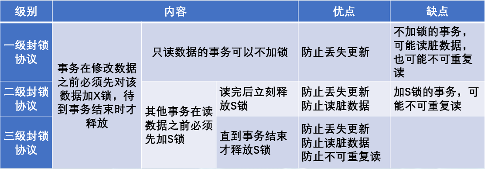

# 六、事务与并发控制

[toc]

数据库是一个共享资源，可以供多个用户使用。

允许多个用户同时使得的数据库系统称为**多用户数据库系统**，例如航空订票系统、银行系统等都是多用户数据库系统。在这样的系统中，在**同一时刻并发运行的事务数可达数百甚至数千个**。

对于多用户数据库系统而言，当多个用户并发操作时，会产生**多个事务同时操作同一数据的情况**。若对并发操作不加以控制，就可能发生读取和写入不正确数据的情况，从而破坏了数据库的**一致性**，所以数据库管理系统必须提供**并发控制**机制。

## 1.事务

所谓的**事务**是指由用户定义的一系列数据库**更新**操作，这些操作，**要么都执行，要么都不执行**，是一个不可分割的逻辑工作单元。这里的更新操作主要指对数据库内容产生修改作用的操作，比如：insert、delete、update等操作。

- 如果事务**成功**执行，那么该事务中所有的更新操作都会成功执行，并将执行结果提交到数据库文件中，成为数据库永久的组成部分。
- 如果事务中某个更新操作执行**失败**，那么事务中的所有更新操作均被撤消。简言之：事务中的更新操作要么都执行，要么都不执行。

### 1.1事务的ACID特性

为了保证事务对数据操作的完整性，对事务需要加以要求和限制，只有满足这些要求或限制才能使数据库在任何情况下都是正确有效的，这是DBMS的责任。

DBMS为了保证在并发访问时对数据库的保护，要求事务具有4个特性，即，简称**ACID特性**。

- **原子性(Atomicity)**

  原子性体现事务所有操作是否被全部完成。事务处理的操作**要么全都完成，要么全都不做**，如果有操作失败，整个事务将要回滚，从而保证事务所有操作成功必将完成所有的数据库修改任务，如果有操作失败数据库将恢复到事务开始之前的状态。

- **一致性(Consistency)**

  一致性是指事务**必须在执行前后都要处于一致性状态**。事务操作全部正确执行，数据库的变化将生效，从而处于有效状态；如果事务处理失败，系统将会回滚，从而恢复到执行前的状态，由于执行前系统处于一致性状态，所以回滚后系统仍然处于一致性状态。

- **隔离性(Isolation)**

  隔离性是面对多用户并发对数据库访问时，**要保证所有并发事务认为只有自己在使用系统，而不为其他事务的操作所干扰**。

- **持久性(Durability)**

  持久性是指**一旦一个事务被完成，那么系统中的数据的改变将会是永久的**，即使系统遭遇了故障的情况下，也不会丢失提交事务的操作。

### 1.2MySQL事务控制语句

#### 开启事务

事务处理首先要开启事务，使用的语句如下所示：

```sql
START TRANSACTION;
```

#### 提交事务

开启事务之后，就开始执行事务内的SQL语句，当SQL语句执行完毕后，必须使用语句提交事务，使用的语句如下：

```sql
COMMIT;
```

#### 回滚事务

开启事务之后，事务中的SQL语句只有在提交事务之后才能运行生效。在提交事务之前，还可以使用语句取消当前事务，叫做回滚事务，具体如下：

```sql
ROLLBACK;
```

例子：

```sql
-- 【例11-1】假设银行存在两个借记卡账户“李三”和“王五”，要求这两个借记卡账户不能用于透支，即两个账户的余额（balance）不能小于0。创建存储过程tran_proc，实现两个账户的转账业务。
#建立account表
CREATE TABLE account(
  Account_no INT PRIMARY KEY,
  Account_name VARCHAR(10) NOT NULL,
  Balance INT UNSIGNED );
#向account表插入记录
  INSERT INTO account VALUES(1, '李三',1000);
  INSERT INTO account VALUES(2, '王五',1000);
```


```sql
-- 【例11-1】假设银行存在两个借记卡账户“李三”和“王五”，要求这两个借记卡账户不能用于透支，即两个账户的余额（balance）不能小于0。创建存储过程tran_proc，实现两个账户的转账业务。
#建立account表
CREATE TABLE account(
  Account_no INT PRIMARY KEY,
  Account_name VARCHAR(10) NOT NULL,
  Balance INT UNSIGNED );
#向account表插入记录
  INSERT INTO account VALUES(1, '李三',1000);
  INSERT INTO account VALUES(2, '王五',1000);
```

结果

```sql
-- 第一次转账业务可以正确实现，结果如图11.1所示。
CALL tran_proc(1,2,800);
SELECT * FROM account;

-- 第二次转账业务由于转账金额超过余额，因此未能正确实现，执行结果如图11.2所示。
CALL tran_proc(1,2,500);
SELECT * FROM account;
```


## 2.并发控制

事务的并发执行：

DBMS同时执行多个事务对同一数据的操作，为此DBMS要**对各事务中的操作顺序进行安排**，以达到同时运行多个事务的目的。这里的并发是指**在单处理器上利用分时方法实现**多个事务**同时操作**。


### 2.1并发执行可能引起的问题

事务中的操作归根结底就是读或写。

两个事务之间的相互干扰就是其操作彼此冲突。因此，事务间的相互干扰问题可归纳为**写-写**、**读-写**和**写-读**3种冲突（读-读不冲突），分别称为“**丢失更新**”、“**不可重复读**”、“**读脏数据**”问题。


#### 2.1.1丢失更新

丢失更新又称为**覆盖未提交的数据**。也就是说，**一个事务更新的数据尚未提交，另一事务又将该未提交的更新数据再次更新，使得前一个事务更新的数据丢失**。

原因：由于两个（或多个）事务对同一数据**并发地写入**引起，称为**写-写**冲突。

结果：与串行地执行两个（或多个）事务的结果不一致。


【例11-3】在表11-1中，数据库中A的初值是100，事务T1对A的值减30，事务T2对A的值增加一倍。
如果执行顺序是先T1后T2，那么结果A的值是140；如果是先T2后T1，那么A的值是170。这两种情况都应该是正确的。但是按表11-1中的并发执行，结果A的值是200，这个值肯定是错误的，因为在时间t0丢失了事务T1对数据库的更新操作。所以这个并发操作是不正确的。

| 时间 | 事务T1  | A的值 | 事务T2 |
| ---- | ------- | ----- | ------ |
| t0   | R(A)    | 100   |        |
| t1   |         | 100   | R(A)   |
| t2   | A:=A-30 |       |        |
| t3   |         |       | A;=A*2 |
| t4   | W(A)    | 70    |        |
| t5   |         | 200   | W(A)   |


#### 2.1.2不可重复读

不可重复读也称为**读值不可复现**。由于**另一事务对同一数据的写入，一个事务对该数据两次读到的值不一样**。

原因：该问题因**读-写**冲突引起。

结果：第二次读的值与前次读的值不同。


【例11-4】表11-2表示T1需要两次读取同一数据项A，但是在两次读取操作的间隔中，另一事务T2改变了A的值。因此，T1在两次读同一数据项A时却读出不同的值。

| 时间 | 事务T1 | A的值 | 事务T2 |
| ---- | ------ | ----- | ------ |
| t0   | R(A)   | 100   |        |
| t1   |        | 100   | R(A)   |
| t2   |        |       | A:=A*2 |
| t3   |        | 200   | W(A)   |
| t4   |        |       | COMMIT |
| t5   | R(A)   | 200   |        |


#### 2.1.3读脏数据

读脏数据也称为**读未提交的数据**。也就是说**一个事务更新的数据尚未提交，被另一事务读到，如前一事务因故要回滚，则后一事务读到的数据已经是没有意义的数据了**，即为**脏数据**。

原因：由于后一事务读了前一事务写了但尚未提交的数据引起，称为**写-读**冲突。

结果：读到有可能要回滚的更新数据。但如果前一事务不回滚，那么后一事务读到的数据仍然是有意义的。


【例11-5】表11-3中事务T1把A的值修改为70，但尚未提交（即未做COMMIT操作），事务T2紧跟着读未提交的A值70。随后，事务T1做了ROLLBACK操作，把A的值恢复为100，而事务T2仍在使用被撤消了的A值70。

| 时间 | 事务T1   | A的值 | 事务T2 |
| ---- | -------- | ----- | ------ |
| t0   | R(A)     | 100   |        |
| t1   | A:=A-30  |       |        |
| t2   | W(A)     | 70    |        |
| t3   |          | 70    | R(A)   |
| t4   | ROLLBACK | 100   |        |


---

产生上述3类数据不一致性的主要原因是**并发操作破坏了事务的隔离性**。

**并发控制**就是要求DBMS提供并发控制功能，以正确的方式执行并发事务，避免并发事务之间相互干扰造成数据的不一致性，保证数据库的完整性和一致性。


### 2.2并发调度的可串行性

1. 多个事务的并发执行是正确的，当且仅当其结果与按某一次序串行地执行它们时的结果相同，称这种调度策略为可串行化的调度。
2. 可串行性是并发事务正确性的准则。按这个准则规定，一个给定的并发调度，当且仅当它是串行化的，才认为是正确调度。


### 2.3并发与并行的区分

- **并发**(Concurrent)**：**当有多个线程在操作时,如果系统只有一个CPU,则它不可能真正同时进行一个以上的线程，它只能把CPU运行时间划分成若干个时间段,再将时间段分配给各个线程执行，在一个时间段的线程代码运行时，其它线程处于挂起状。
- **并行**(Parallel)：当系统有一个以上CPU时,则线程的操作有可能非并发。当一个CPU执行一个线程时，另一个CPU可以执行另一个线程，两个线程互不抢占CPU资源，可以同时进行。

**区别：**并发和并行是即相似又有区别的两个概念，并行是指两个或者多个事件在同一时刻发生；而并发是指两个或多个事件在同一时间间隔内发生。


### 2.4事务的隔离级别

**隔离性**是事务最重要的基本特性之一，是解决事务并发执行时可能发生的相互干扰问题的基本技术。

**隔离级别定义了一个事务与其他事务的隔离程度**。

为了更好地理解隔离级别，再来看并发事务对同一数据库进行访问可能发生的情况。在并发事务中，总的来说会发生以下3种异常情况。

在并发事务中，总的来说会发生以下3种情况：

（1）**丢失更新**
丢失更新就是一个事务更新的数据尚未提交，另一事务又将该未提交的更新数据再次更新，使得前一个事务更新的数据丢失。

（2）**不可重复读**
不可重复读是指当一个事务读取数据库中的数据后，另一个事务更新了数据，当第一个事务再次读取该数据时，发现数据已经发生改变，导致一个事务前后两次读取的数据值不相同。

（3）**读脏数据**
读脏数据就是当一个事务修改数据时，另一个事务读取了修改的数据，并且第一个事务由于某种原因取消了对数据的修改，使数据库回到原来的状态，这时第二个事务中读取的数据与数据库中的数据已经不相符。


隔离级别分为以下4级：

（1）**未提交读**（READ UNCOMMITED）：
在此隔离级别下，**用户可以对数据执行未提交读**；在事务结束前可以更改数据内的数值，行也可以出现在数据集中或从数据集消失。它是4个级别中限制最小的级别。

（2）**提交读**（READ COMMITED）：
此隔离级别**不允许用户读一些未提交的数据**，因此不会出现读脏数据的情况，**但数据可以在事务结束前被修改**，从而产生不可重复读。

（3）**可重复读**（REPEATABLE READ）：
此隔离级别**保证在一个事务中重复读到的数据会保持同样的值**，而不会出现读脏数据、不可重复读的问题。但允许其他用户将新的幻影行插入数据集，且幻影行包括在当前事务的后续读取中。

（4）**可串行读**（SERIALIZABLE）：
此隔离级别是4个隔离级别中限制最大的级别，**不允许其他用户在事务完成之前更新数据集或将行插入到数据集内**。


4种隔离级别允许的不同类型的行为：

| 隔离级别                         | 丢失更新 | 读脏数据 | 不可重复度 |
| -------------------------------- | -------- | -------- | ---------- |
| 未提交读<br/>（READ UNCOMMITED） | 是       | 是       | 是         |
| 提交读<br/>（READ COMMITED）     | 否       | 否       | 是         |
| 可重复读<br/>（REPEATABLE READ） | 否       | 否       | 否         |
| 可串行读<br/>（SERIALIZABLE）    | 否       | 否       | 否         |


## 3.封锁

封锁是实现并发控制的一个非常重要的技术。所谓封锁，就是**事务T在对某个数据对象（例如表、记录等）操作之前先向系统发出请求，对其加锁**。

一个锁实质上就是**允许（或阻止）一个事务对一个数据对象的存取特权**。一个事务对一个对象加锁的结果是将别的事务封锁在该对象之外，特别是防止了其他事务对该对象的更改，而加锁的事务则可执行它所希望的处理，并维持该对象的正确状态。一个锁总是与某一事务的一个操作相联系的。


### 3.1基本锁

锁可以有多种不同的类型，最基本的有两种，即**排他锁**（Exclusive Locks）和**共享锁**（Share Locks）。

1. **排他锁（X锁）**

**排他锁**又称为**写锁**。若一个事务T1在数据对象R上获得了排他锁，则T1既可对R进行读操作，也可进行写操作。其他任何事务不能对R加任何锁，因而不能进行任何操作，直到T1释放了它对R加的锁。所以排他锁就是**独占锁**。

2. **共享锁（S锁）**

**共享锁**又称为**读锁**。若一个事务T1在数据对象R上获得了共享锁，则它能对R进行读操作，但不能写R。其他事务可以也只能同时对R加共享锁。

显然，排他锁比共享锁更“强”，因为共享锁只禁止其他事务的写操作，而排他锁既禁止其他事务的写又禁止读。


常用XLOCK表示对A上加X锁，SLOCK表示对A加S锁，UNLOCK A表示释放A上的封锁。

### 3.2基本锁的相容矩阵

根据X锁、S锁的定义，可以得出基本锁的相容矩阵，如表11-5所示。表中表明，当一个数据对象R已被事务持有一个锁，而另一事务又想在R上加一个锁时，只有两种锁同为共享型锁才有可能。如果要请求对R加一个排他锁，只有在R上无任何事务持有锁时才可以。

|            | 请求锁 | 请求锁 | 请求锁 |
| ---------- | ------ | ------ | ------ |
| **持有锁** | S      | X      | --     |
| S          | Y      | N      | Y      |
| X          | N      | N      | Y      |
| --         | Y      | Y      | Y      |


### 3.3锁的粒度

**封锁对象的大小称为封锁的粒度**（Lock Granularity）。

根据对数据的不同处理，封锁的对象可以是字段、记录、表、数据库等逻辑单元，也可以是页（数据页或索引页）、块等物理单元。

封锁粒度与系统的并发度和并发控制的开销密切相关。

封锁粒度越小，系统中能够被封锁的对象就越多，但封锁机构复杂，系统开销也就越大；相反，封锁粒度越大，系统中能够被封锁的对象就越少，并发度越小，封锁机构简单，相应系统开销也就越小。

因此，在实际应用中选择封锁粒度应同时考虑封锁机构和并发度两个因素，**对系统开销**与**并发度**进行权衡，以求得最优的效果。一般来说，需要处理大量元组的用户事务可以以关系为封锁单元；而对于一个处理少量元组的用户事务，可以以元组为封锁单元，以提高并发度。


### 3.4封锁协议

在运用封锁机制时还需要约定一些**规则**，例如何时开始封锁、封锁多长时间、何时释放等，这些封锁规则称为**封锁协议**（lock protocol）。

前面讲过的并发操作所带来的丢失更新、读脏数据和不可重复读等数据不一致性问题，可以通过**三级封锁协议**在不同程度上给予解决。


#### 3.4.1一级封锁协议

一级封锁协议的内容：**事务T在修改数据对象之前必须对其加X锁，直到事务结束**。

一级封锁协议规定事务在更新数据对象时必须获得X锁，使得两个同时要求更新R的并行事务之一必须在一个事务更新操作执行完成之后才能获得X锁，这样就避免了两个事务读到同一个R值而先后更新所发生的**数据丢失更新**问题。

但一级封锁协议只有当**修改数据**时才进行加锁，如果只是读取数据，并不加锁，所以它不能防止读脏数据和不可重复读的情况。

**解决数据丢失问题：**

| 时间 | 事务T1   | A的值 | 事务T2   |
| ---- | -------- | ----- | -------- |
| t0   | XLOCK A  |       |          |
| t1   | R(A)     | 100   |          |
| t2   |          |       | XLOCK A  |
| t3   | A:=A-30  |       | 等待     |
| t4   | W(A)     | 70    | 等待     |
| t5   | COMMIT   |       | 等待     |
| t6   | UNLOCK X |       | 等待     |
| t7   |          |       | XLOCK A  |
| t8   |          | 70    | R(A)     |
| t9   |          |       | A:=A*2   |
| t10  |          | 140   | W(A)     |
| t11  |          |       | COMMIT   |
| t12  |          |       | UNLOCK X |


#### 3.4.2二级封锁协议

二级封锁协议的内容：**在一级封锁协议的基础上加上“事务T在读取数据对象R之前必须先对其加S锁，读完后释放S锁”**。

二级封锁协议不但可以解决数据丢失更新问题，还可以**进一步防止读脏数据**。但二级封锁协议在读取数据之后立即释放S锁，所以它仍然不能解决不可重复读的问题。

**解决读脏数据问题：**

| 时间 | 事务T1   | A的值 | 事务T2   |
| ---- | -------- | ----- | -------- |
| t0   | XLOCK A  |       |          |
| t1   | R(A)     | 100   |          |
| t2   | A:=A-30  |       |          |
| t3   | W(A)     | 70    |          |
| t4   |          |       | SLOCK A  |
| t5   | ROLLBACK | 100   | 等待     |
| t6   | UNLOCK X |       | 等待     |
| t7   |          |       | SLOCK A  |
| t8   |          | 100   | R(A)     |
| t9   |          |       | COMMIT   |
| t10  |          |       | UNLOCK S |


#### 3.4.3三级封锁协议

三级封锁协议的内容：**在一级封锁协议的基础上加上“事务T在读取数据R之前必须先对其加S锁，读完后并不释放S锁，直到事务T结束才释放”**。

所以三级封锁协议除了可以防止丢失更新和读脏数据外，还可以**进一步防止不可重复读**，彻底解决了并发操作带来的三种不一致性问题。

**解决不可重复读问题：**

| 时间 | 事务T1   | A的值 | 事务T2   |
| ---- | -------- | ----- | -------- |
| t0   | SLOCK A  |       |          |
| t1   | R(A)     | 100   |          |
| t2   |          |       | XLOCK A  |
| t3   | R(A)     | 100   | 等待     |
| t4   | COMMIT   |       | 等待     |
| t5   | UNLOCK S |       | 等待     |
| t6   |          |       | XLOCK A  |
| t7   |          | 100   | R(A)     |
| t8   |          |       | A:=A*2   |
| t9   |          | 200   | W(A)     |
| t10  |          |       | COMMIT   |
| t11  |          |       | UNLOCK X |

#### 3.4.4封锁协议总结



### 3.5封锁带来的问题

利用封锁技术可以避免并发操作引起的各种错误，但有可能产生新的问题，即**活锁**、**饿死**和**死锁**。

#### 3.5.1“饿死”问题

有可能存在一个事务序列，其中的每个事务都申请对某数据项加S锁，且每个事务在授权加锁后一小段时间内释放封锁，此时若另一事务T2要在该数据项上加X锁，则将永远轮不上封锁的机会。这种现象称为“饿死”（Starvation）。

可以用下列授权方式来避免事务被“饿死”。

当事务T中请求对数据R加S锁时，授权加锁的条件如下：

（1）不存在数据R上持有X锁的其他事务。
（2）不存在等待对数据R加锁且先于T申请加锁的事务。

#### 3.5.2“活锁”问题

系统可能使某个事务永远处于等待状态，得不到封锁的机会，这种现象为“活锁”（live lock）。

例如，事务T1在对数据R封锁后，事务T2又请求封锁R，于是T2等待；T3也请求封锁R，当T1释放R上的封锁后，系统首先批准了T3的请求，T2继续等待；然后又有T4请求封锁R，T3释放了R上的封锁后，系统又批准了T4的请示；依此类推，T2可能永远处于等待状态，从而发生“活锁”。

解决“活锁”问题的一种简单方法是采用“**先来先服务**”的策略。

#### 3.5.3“死锁”问题

系统中两个或两个以上的事务都处于等待状态，并且每个事务都在等待其中另一个事务解除封锁，才能继续执行下去，结果造成任何一个事务都无法继续执行，这种现象称系统进入“死锁”（dead lock）状态。

例如，事务T1等待事务T2释放它对数据对象持有的锁，事务T2等待事务T3释放它的锁，依此类推，最后事务Tn又等待T1释放它持有的某个锁，从而形成了一个锁的等待圈，产生“死锁”。

---

1. **“死锁”的预防**

预防死锁有两种方法，即一次加锁法和顺序加锁法。

（1）**一次加锁法**：
一次加锁法是每个事务必须将所有要使用的数据对象全部依次加锁，并要求加锁成功，只要一个加锁不成功，则表示本次加锁失败，应该立即释放所有已加锁成功的数据对象，然后重新开始从头加锁。

（2）**顺序加锁法**：
顺序加锁法是预先对所有可加锁的数据对象强加一个封锁的顺序，同时要求所有事务都只能按此顺序封锁数据对象。

2. **“死锁”的检测与解除**

预防死锁的代价太高，还可能发生许多不必要的回退操作。因此，现在大多数DBMS采用的方法是允许死锁发生，然后设法发现它、解除它。

死锁的检测：利用事务等待图测试系统中是否存在死锁。

死锁的解除：死锁测试程序


### 3.6两段封锁协议2PL

DBMS对并发事务不同的调度（即事务的执行次序）可能会产生不同的结果，那么什么样的调度是正确的呢？

显然，串行调度是正确的，执行结果等价于串行调度的调度也是正确的，这样的调度称为**可串行化调度**。

前面说明了封锁是一种最常用的并发控制技术，**可串行性是并发调度的一种正确性准则**。


接下来的问题是怎么封锁其调度才是可串行化的？最简单而有效的方法是采用**两段封锁协议**（Two-Phase Locking protocol，2PL协议）。

两段封锁协议规定所有的事务应遵守下面两条规则：

（1）在对任何一个数据进行读/写操作之前，首先要申请并获得对该数据的封锁。
（2）在释放一个封锁后，事务不再申请和获得任何其他封锁。


两段锁的含义是，事务分为两个阶段。

第一阶段是**获得封锁**，也称为“扩展”阶段。在这个阶段，事务可以申请获得任何数据项上的任何类型的锁，但是不能释放任何锁；

第二阶段是**释放封锁**，也称为“收缩”阶段，在这个阶段，事务可以释放任何数据项上的任何类型的锁，但是不能再申请任何锁。


遗憾的是，两段封锁协议**仍有可能导致死锁的发生**，而且可能会增多，这是因为每个事务都不能及时解除被它封锁的数据。
