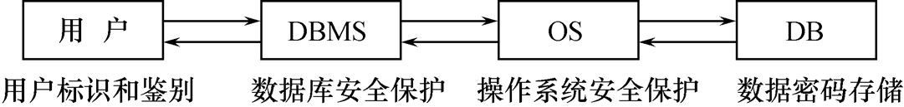

# 七、数据库安全与保护

[toc]

问题的提出：

数据库的一大特点是数据可以共享
数据共享必然带来数据库的安全性问题
数据库系统中的数据共享不能是无条件的共享

数据库的**安全性**是指**保护数据库以防止不合法使用所造成的数据泄露、更改或破坏**。

系统安全保护措施是否有效是数据库系统主要的性能指标之一。

## 安全性

计算机系统存在技术安全、管理安全和政策法律三类安全性问题。

TCSEC/TDI 标准由安全策略、责任、保证和文档四个方面内容构成。

---

数据库的安全性是指保护数据库，防止不合法的使用，以免数据的泄露、更改或破坏。

数据库的安全性和完整性这两个概念听起来有些相似，有时容易混淆，但两者是完全不同的。

1. **安全性**：保护数据以防止非法用户**故意**造成的破坏，确保合法用户做其想做的整改。
2. **完整性**：保护数据以防止合法用户**无意**中造成的破坏，确保用户所做的事情是正确的。

两者不同的关键在于“合法”和“非法”及“故意”与“无意”。

---

数据库的不安全因素：

1. 非授权用户对数据库的恶意存取和破坏
2. 数据库中重要或敏感的数据被泄露
3. 安全环境的脆弱性

---

为了保护数据库，防止故意的破坏，可以从低到高的5个级别上设置各种安全措施。

1. **物理控制**：
   计算机系统的机房和设备应加以保护，通过加锁或专门监护等防止系统场地被非法进入，从而进行物理破坏。
2. **法律保护**：
   通过立法、规章制度防止授权用户以非法形式将其访问数据库的权限转授给非法者。
3. **操作系统支持**：
   无论数据库系统是多么安全，操作系统的安全弱点均可能成为入侵数据库的手段，应防止未经授权的用户从操作系统处着手访问数据库。
4. **网络管理**：
   由于大多数DBMS都允许用户通过网络进行远程访问，所以网络软件内部的安全性是很重要的。
5. **DBMS**实现：
   DBMS安全机制的职责是检查用户的身份是否合法及使用数据库的权限是否正确。

---

计算机系统安全模型：



- 系统根据用户标识鉴定用户身份，合法用户才准许进入计算机系统
- 数据库管理系统还要进行存取控制，只允许用户执行合法操作 
- 操作系统有自己的保护措施 
- 数据可以以密码形式存储到数据库中

---

数据库安全性控制的常用方法：

1. 用户标识和鉴定
2. 存取控制
3. 视图
4. 审计
5. 数据加密


## 访问控制

1. 用户账号管理
2. 账户权限管理


## 数据库安全性控制

首先，数据库管理系统对提出SQL访问请求的数据库**用户进行身份鉴别**，防止不可信用户使用系统。

然后，在SQL处理层进行**自主存取控制**和**强制存取控制**，进一步可以进行**推理控制**。

还可以对用户访问行为和系统关键操作进行**审计**，对异常用户行为进行简单入侵检测。


### 用户标识和鉴别

用户身份鉴别（Identification &  Authentication）

- 系统提供的最外层安全保护措施
- 用户标识：由用户名和用户标识号组成（用户标识号在系统整个生命周期内唯一）

用户标识和鉴别方法：

1. **静态口令鉴别**
   静态口令一般由用户自己设定，这些口令是静态不变的。
2. **动态口令鉴别**
   口令是动态变化的，每次鉴别时均需使用动态产生的新口令登录数据库管理系统，即采用一次一密的方法。
3. **生物特征鉴别**
   通过生物特征进行认证的技术，生物特征如指纹、虹膜和掌纹等。
4. **智能卡鉴别**
   智能卡是一种不可复制的硬件，内置集成电路的芯片，具有硬件加密功能。


### 存取控制

存取控制策略：

数据库安全最重要的一点就是确保**只授权给有资格的用户访问数据库的权限，同时令所有未被授权的人员无法接触数据**，这主要通过数据库系统的**存取控制策略**来实现。

存取控制机制组成：

1. **定义用户权限**，并将用户权限登记到数据字典中
   用户对某一数据对象的操作权力称为权限 
   DBMS提供适当的语言来定义用户权限，存放在数据字典中，称做安全规则或授权规则。 
2. **合法权限检查** 
   用户发出存取数据库操作请求
   DBMS查找数据字典，进行合法权限检查。

**用户权限定义**和**合法权检查机制**一起组成了数据库管理系统的存取控制子系统。

---

常用存取控制方法包括**自主存取控制(DAC)**和**强制存取控制(MAC)**两种。

1. **自主存取控制**（Discretionary Access Control ，简称 DAC）
   用户对不同的数据对象有不同的存取权限
   不同的用户对同一对象也有不同的权限
   用户还可将其拥有的存取权限转授给其他用户
2. **强制存取控制**（Mandatory Access Control，简称 MAC）
   每一个数据对象被标以一定的密级
   每一个用户也被授予某一个级别的许可证
   对于任意一个对象，只有具有合法许可证的用户才可以存取


#### 自主存取控制(DAC)

自主存取控制(DAC)的 SQL 语句包括 **GRANT** 和 **REVOKE** 两个。 

用户权限由**数据对象**和**操作类型**两部分构成。

定义用户存取权限：**定义用户可以在哪些数据库对象上进行哪些类型的操作**。

定义存取权限称为**授权**。

权限类型：

自主存取控制的权限类型分为两种，即角色权限和数据库对象权限。

1. **角色权限**：
   给角色授权，并为用户分配角色，用户的权限为其角色权限之和。角色权限由DBA授予。
2. **数据库对象权限**：
   不同的数据库对象，可提供给用户不同的操作。该权限由DBA或该对象的所有者（Owner）授予用户。


##### 存取控制方法：授权与回收

定义一个用户的存取权限就是要定义这个用户可以在哪些数据对象上进行哪些类型的操作。在数据库系统中，定义存取权限成为授权。

###### GRANT授权

```sql
grant <> [,<>]...
on <对象类型> <对象名> [,<对象类型> <对象名>]...
to <用户> [,<用户>]...
[with grant option]
```

将对指定操作对象的指定操作权限授予指定的用户，发出该grant语句的可以是DBA，也可以是已经拥有该权限的用户。接收权限的用户可以是一个或多个具体用户，也可以是PUBLIC，即全体用户。指定WITH GRANT OPTION子句，则获得某种权限的用户还可以把这种权限授权给其他用户.

```sql
grant all privileges
on table student,sc
to user1
with grant option;
```

###### REVOKE回收

```sql
revoke <> [,<>]...
on <对象类型> <对象名> [,<对象类型> <对象名>]...
from <用户> [,<用户>]...
```

cascade会级联：依次向下收回权限

```sql
revoke insert
on table student
from user1 cascade;
```

创建数据库模式的权限

```sql
create user <username>
[with] [dba|resource|connect]
```


#### 强制存取控制(MAC)

自主存取能够通过授权机制有效地控制对敏感数据的存取，但它存在一个**漏洞**——一些别有用心的用户可以欺骗一个授权用户，采用一定的手段来获取敏感数据。

> 例如，领导Manager是客户单Customer关系的物主，他将“读”权限授予用户A，且A不能再将权限转授他人，其目的是让A审查客户信息，看有无错误。现在A自己另外创建一个新关系A_Customer，然后将自Customer读取的数据写入（即复制到）A_Customer。这样，A是A_Customer的物主，他可以做任何事情，包括再将其权限转授给任何其他用户。
>
> 存在这种漏洞的根源在于，自主存取控制机制仅以授权将用户（主体）与被存取数据对象（客体）关联，通过控制权限实现安全要求，对用户和数据对象本身未做任何安全性标注。强制存取控制就可以处理自主存取控制的这种漏洞。

强制存取控制（MAC）：

1. 保证更高程度的安全性
2. 用户不能直接感知或进行控制
3. 适用于对数据有严格而固定密级分类的部门
   -  军事部门
   -  政府部门

在强制存取控制中，数据库管理系统所管理的全部实体被分为**主体**和**客体**两大类。

- **主体**是系统中的活动实体
  -  数据库管理系统所管理的实际用户
  -  代表用户的各进程
- **客体**是系统中的被动实体，受主体操纵
  - 文件、基本表、索引、视图

---

**敏感度标记**（Label）

对于主体和客体，DBMS为它们每个实例（值）指派一个敏感度标记（Label）

敏感度标记分成若干级别：

- 绝密（Top Secret，TS）
- 机密（Secret，S）
- 可信（Confidential，C）
- 公开（Public，P）
- TS>=S>=C>=P

主体的敏感度标记称为**许可证级别**（Clearance Level）
客体的敏感度标记称为**密级**（Classification Level）

---

强制存取控制规则：

1. 仅当主体的许可证级别大于或等于客体的密级时，该主体才能读取相应的客体。
2. 仅当主体的许可证级别小于或等于客体的密级时，该主体才能写相应的客体。

强制存取控制是**对数据本身进行密级标记**，无论数据如何复制，标记与数据都是一个不可分的整体，只有符合密级标记要求的用户才可以操纵数据，从而提供了更高级别的安全性。

强制存取控制的**优点**是系统能**执行“信息流控制”**。

【注意】这种方法在通用数据库系统中不是十分有用，它只在某些专用系统中有用，例如军事部门或政府部门。


## MySQL的安全设置

MySQL安全设置用于实现“正确的人”能够“正确的访问”“正确的数据库资源”。

MySQL通过两个模块实现数据库资源的安全访问控制，即**身份认证模块**和**权限验证模块**。

- **身份认证模块**：用于**实现数据库用户在某台登录主机的身份认证**，只有通过身份认证的数据库用户才能登录主机并成功连接到MySQL服务器，继而向MySQL服务器发送MySQL命令或SQL语句；
- **权限验证模块**：用于**验证MySQL账户是否有权执行该MySQL命令或SQL语句**，确保“数据库资源”被真确地访问或者执行。


### 用户管理

#### 1.创建登录用户

创建用户的语法形式如下：

```sql
CREATE USER 用户 [IDENTIFIED BY [PASSWORD] '密码'] [,用户 [IDENTIFIED BY [PASSWORD] '密码']]…;
```

【说明】：

1. 用户的格式：用户名@主机名。其中，主机名指定了创建的用户使用MySQL连接的主机。另外，“%”表示一组主机，localhost表示本地主机。
2. IDENTIFIED BY子句指定创建用户时的密码。如果密码是一个普通的字符串，则不需要使用PASSWORD关键字。

```sql
-- 【例12-1】创建用户tempuser，其口令为temp。
CREATE USER tempuser@localhost IDENTIFIED BY 'temp';
```

创建的新用户的详细信息自动保存在系统数据库mysql的user表中，执行如下SQL语句，可查看数据库服务器的用户信息。

```sql
USE mysql;
SELECT * FROM user;
```


#### 2.修改用户密码

修改用户密码的语法形式如下：

```sql
SET PASSWORD FOR 用户= '新密码';

-- 【例12-2】修改用户tempuser的密码为abc。
SET PASSWORD FOR tempuser@localhost='abc';
```


#### 3.修改用户名

修改用户名的语法形式如下：

```sql
RENAME USER 旧用户名 To 新用户名 [ ,旧用户名 To 新用户名] [...]

-- 【例12-3】修改普通用户tempuser的用户名为temp_U。
RENAME USER tempuser@localhost TO temp_U@localhost;
```


#### 4.删除用户

使用DROP USER语句可删除一个或多个MySQL用户，并取消其权限。
其语法形式如下：

```sql
DROP USER 用户[,…];

-- 【例12-5】删除用户temp_U。
DROP USER temp_U@localhost;
```


### 权限管理

权限管理主要是对登录到MySQL服务器的数据库用户进行权限验证。所有用户的权限都存储在MySQL的权限表中。

合理的权限管理能够保证数据库系统的安全，不合理的权限设置会给数据库系统带来危害。

权限管理主要包括两个内容，即**授予权限**和**撤销权限**。

#### 1.授予权限grant

GRANT语句的一般格式：

```sql
GRANT <权限>[,<权限>]... 
ON <对象类型> <对象名>[,<对象类型> <对象名>]…
TO <用户>[,<用户>]...
[WITH GRANT OPTION];
```

语义：将对指定操作对象的指定操作权限授予指定的用户


发出GRANT：

- 数据库管理员
- 数据库对象创建者（即属主Owner）
- 拥有该权限的用户

接受权限的用户：

- 一个或多个具体用户
- PUBLIC（即全体用户）

WITH GRANT OPTION子句：

- 指定：可以再授予
- 没有指定：不能传播

不允许循环授权

```sql
-- 【例】把查询Student表权限授给用户U1。
USE jwgl13;
CREATE USER U1@localhost IDENTIFIED BY '123456';
GRANT SELECT 
ON TABLE Student 
TO U1@localhost;

#创建用户并授权后，为了使其生效，输入命令:
FLUSH PRIVILEGES;
```

2:

```sql
-- 【例】把对Student表的全部权限授予用户U2和U3。
USE jwgl13;
CREATE USER U2@localhost IDENTIFIED BY '123456';
CREATE USER U3@localhost IDENTIFIED BY '123456';

GRANT ALL PRIVILEGES
ON TABLE Student
TO U2@localhost,U3@localhost;
FLUSH PRIVILEGES;
```


#### 2.撤销权限revoke

授予的权限可以由数据库管理员或其他授权者用REVOKE语句收回。

REVOKE语句的一般格式为：

```sql
REVOKE <权限>[,<权限>]... 
ON <对象类型> <对象名>[,<对象类型><对象名>]…
FROM <用户>[,<用户>]...[CASCADE | RESTRICT];
```

例：

```sql
-- 【例】把用户U1查询student表的权限收回。
REVOKE SELECT
ON TABLE student
FROM U1@localhost;

-- 【例】把用户U4修改学生姓名的权限收回。
REVOKE UPDATE(Sname)
ON TABLE Student 
FROM U4@localhost;

-- 【例】收回所有用户对表Score的查询权限。
REVOKE SELECT 
ON TABLE Score 
FROM PUBLIC;

-- 【例】把用户U5对Score表的INSERT权限收回。
REVOKE INSERT 
ON TABLE Score
FROM U5@localhost;
```


#### 小结：SQL灵活的授权机制

**数据库管理员**：

拥有所有对象的所有权限
根据实际情况不同的权限授予不同的用户

**用户**：

拥有自己建立的对象的全部的操作权限
可以使用GRANT，把权限授予其他用户

**被授权的用户**：

如果具有“继续授权”的许可，可以把获得的权限再授予其他用户
所有授予出去的权力在必要时又都可用REVOKE语句收回。


### 角色管理

数据库角色：被命名的一组与数据库操作相关的权限。

- 角色是权限的集合 
- 可以为一组具有相同权限的用户创建一个角色
- 简化授权的过程


1.角色的创建

```sql
CREATE  ROLE  <角色名> 
```

2.给角色授权 

```sql
 GRANT  <权限>[,<权限>]… 
 ON <对象类型>对象名  
 TO <角色>[,<角色>]…
```

3.将一个角色授予其他的角色或用户

```sql
GRANT  <角色1>[,<角色2>]…
TO  <角色3>[,<用户1>]… 
[WITH ADMIN OPTION]
```

- 该语句把角色授予某用户，或授予另一个角色；
- 授予者是角色的创建者或拥有在这个角色上的ADMIN OPTION；
- 指定了WITH ADMIN OPTION则获得某种权限的角色或用户还可以把这种权限授予其他角色。

一个角色的权限：直接授予这个角色的全部权限加上其他角色
授予这个角色的全部权限。

4.角色权限的收回 

```sql
REVOKE <权限>[,<权限>]…
ON <对象类型> <对象名>
FROM <角色>[,<角色>]…
```

- 用户可以回收角色的权限，从而修改角色拥有的权限。
- REVOKE执行者是角色的创建者
- 拥有在这个（些）角色上的ADMIN OPTION

5.删除角色

语法形式如下：

```sql
DROP ROLE角色[,角色,…];
```


例

```sql
-- 【例】通过角色来实现将一组权限授予一组用户。
-- 步骤如下：

-- （1）首先创建一个角色 R1
USE jwgl13;
CREATE ROLE R1@localhost;
-- （2）然后使用GRANT语句，使角色R1拥有Student表的SELECT、UPDATE、INSERT权限。
GRANT SELECT, UPDATE, INSERT 
ON TABLE Student 
TO R1@localhost;
-- （3）创建用户U_A、U_B、U_C
CREATE USER U_A@localhost IDENTIFIED BY '111111';
CREATE USER U_B@localhost IDENTIFIED BY '111111';
CREATE USER U_C@localhost IDENTIFIED BY '111111';
-- （4）将这个角色授予U_A、U_B、U_C，使他们具有角色R1所包含的全部权限。
GRANT R1@localhost
TO U_A@localhost,U_B@localhost,U_C@localhost;

-- 验证角色是否正确分配，可使用SHOW GRANTS语句：
SHOW GRANTS FOR U_A@localhost 
USING R1@localhost;

-- 注意：用户在使用角色权限前必须激活角色，命令形式如下：
SET GLOBAL activate_all_roles_on_login=ON;

-- （5）可以一次性通过R1来回收U_A的这3个权限
REVOKE R1@localhost FROM U_A@localhost;

```

例2

```sql
-- 【例】角色的权限修改。
-- 使角色R1在原来的基础上增加了Student表的DELETE 权限。
GRANT DELETE 
ON TABLE Student
TO R1@localhost;

-- 【例】收回R1的SELECT权限。
REVOKE SELECT 
ON TABLE Student
FROM R1@localhost; 

-- 【例】删除角色。
DROP ROLE R1@localhost; 
```


## 备份与恢复

导出一整个数据库：

```cmd
C:\WINDOWS\system32> mysqldump -u 用户名 -p 数据库名 > 导出的文件名

C:\WINDOWS\system32> mysqldump -u root -p user > d:\demo.sql
```

导出一张表：

```cmd
C:\WINDOWS\system32> mysqldump -u 用户名 -p 数据库名 表名称 > 导出的文件名
C:\WINDOWS\system32> mysqldump -u root -p user user_1 > d\demo.sql
```

恢复：
数据的回复必须要先登录,登录成功后新建一个数据库,进入到指定的数据库中执行如下命令

```cmd
mysql> Source 脚本目录(绝对路径)
mysql> Source C:\java\demo.sql
```


## 审计

1. 审计功能把用户对数据库的所有操作自动记录下来放入审计日记中。DBA可以利用审计跟踪的信息，重现导致数据库出现现有状况的一系列事件，中出非法存取数据的人、时间和内容等。
2. 审计通常是费时间和空间的，一般主要用于安全性要求较高的部门。
3. 审计一般可以分为用户级审计和系统级审计。
4. AUDIT语句用来设置审计功能，NOAUDIT用来取消审计功能。

```sql
audit alter,update
on student;

noaudit all
on student;
```

