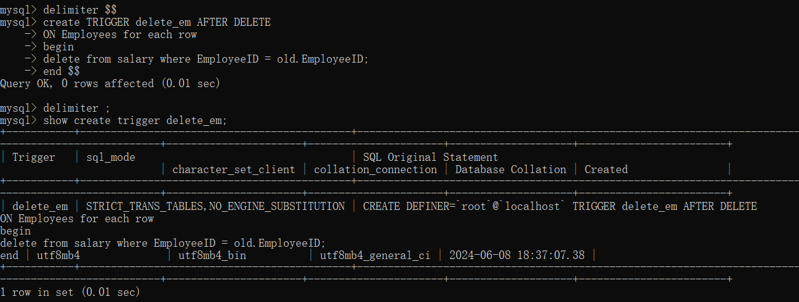
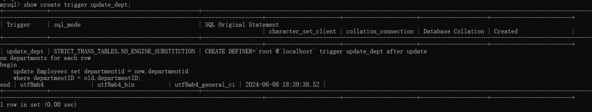

## 关系运算

使用关系代数表示每个查询

### 一

S (<u>SNO</u>, SN, AGE, SEX)
C (<u>CNO</u>, CN, CREDIT)
SC (<u>SNO</u>, <u>CNO</u>, SCORE)

1. 查询课程号为`C1`的学生的学号和成绩：

$∏_{SNO,SCORE}(σ_{CNO='C1'}(SC))$

2. 查询课程号为`C2`的学生的学号和姓名：

❗$∏_{SNO,SN}(σ_{CNO='C2'}(S⋈SC))$

或者写为（先查找C2的学生号，在连接学生表S）：

$∏_{SNO,SN}( ∏_{SNO}(σ_{CNO='C2'}(SC))⋈S)$

3. 查询课程名字为`maths`的学生的学号和姓名：

$∏_{SNO,SN}(σ_{CN='maths'}(S⋈SC⋈C))$

4. 查询课程号为`C3`或`C4`的学生的学号：

$∏_{SNO}(σ_{CNO='C3'∨CNO='C4'}(SC))$

5. 查询没有选修课程号为`C5`的学生的学号，姓名：

$∏_{SNO,SN}(S)-∏_{SNO,SN}(σ_{CNO='C5'}(SC⋈S))$

### 二

Teache (<u>Tno</u>, Tname, Tage, Tsex)
Department (<u>Dno</u>, Dname, Tno)（Tno是管理这个department的系主任）
Work (<u>Tno</u>, <u>Dno</u>, Year, Salary)

1. 列出工资超过5000的教师的不同年龄：

❓$∏_{Tage}(Teather⋈σ_{Salary>5000}(Work))$

2. 查找不在计算机系工作的教师代码：

$∏_{Tno}(Work)-∏_{Tno}(Work⋈∏_{Dno}(σ_{Dname='计算机系'}(Department)))$

3. 系主任T1管辖范围内的所有教师姓名：

$∏_{Tname}(Teacher⋈∏_{Tno}(Work⋈∏_{Dno}(σ_{Tno='T1'}(Department))))$

### 三P45Q8

学生S (学号S#, 姓名SN, 所在系SD, 年龄SA)
课程C (课程号C#, 课程名CN, 先修课程号PC#)
成绩SC (学号S#, 课程号C#, 成绩G)

1. 检索年龄大于等于20岁的学生的姓名：

$∏_{SN}(σ_{SA>=20}(S))$

2. 检索先修课程号为C2的课程号和课程名。

$∏_{C\#,CN}(σ_{PC\#='C2'}(C))$

3. 检索课程号C1的成绩为90分以上的所有学生的姓名。

$∏_{SN}(σ_{C\#='C1'∧G>90}(SC⋈S))$

4. 检索001号学生选修的所有课程名及先修课程号。

$∏_{CN,PC\#}(σ_{S\#='001'}(SC⋈C))$

5. 检索计算机系学生所选修课程的课程号和课程名。

$∏_{C\#,CN}(σ_{SD='计算机系'}(S⋈SC⋈C))$

## 关系模式

### 四P46Q10

(1)关系模式R的主关键字是

```
{运动员编号, 项目号}
```

(2)R最高属干第一范式（1NF）。
因为存在着姓名，性别，班级，项目名对主关键字{运动员编号，项目号}的**部分函数依赖**，所以没有达到2NF。

(3)首先分解为2NF：

```
R1运动员(运动员编号,姓名,性别,班级,班主任)
R2比赛项目(项目号,项目名)
R3比赛(运动员编号,项目号,成绩)
```

因为 R1 中还存在班主任对运动员编号的**传递函数依赖**，所以没有达到3NF，再分解为3NF：

```
R1运动员(运动员编号,姓名,性别,班级)
R2比赛项目(项目号,项目名)
R3比赛(运动员编号,项目号,成绩)
R4班级(班级,班主任)
```

# SQL

### 五

建数据库表

```sql
CREATE TABLE Employees
(
    EmployeeID char(6) not null,
    Name char(10) not null,
    Education char(4) not null,
    Brithday date not null,
    Sex char(2) not null default '1',
    EntryYear tinyint(1),
    Address varchar(20),
    PhoneNumber char(12),
    DepartmentID char(3) not null,
    PRIMARY key(EmployeeID)
)engine=innodb;

CREATE TABLE Departments(
    departmentID char(3) not null PRIMARY KEY,
    departmentName char(20) not NULL,
    note text(16)
);

CREATE TABLE Salary(
    employmeeID char(6) not NULL PRIMARY KEY,
    Income float(8) not NULL,
    Outcome float(8) not NULL
);
```

在员工管理数据库中创建触发器delete_em，在Employees表中删除员工信息的同时，将Salary表中该员工的信息删除，以确保数据完整性。（员工管理数据库详见P250-251）

```sql
delimiter $$
create TRIGGER delete_em AFTER DELETE 
ON Employees for each row
begin
	delete from salary where EmployeeID = old.EmployeeID;
end $$
delimiter ;

-- 展示
show create trigger delete_em;
-- eg:
delete from Employees where EmployeeID='010008';
```



在员工管理数据库中创建触发器update_dept，当Departments表中的部门号发生变化时，Employees表中员工所属部门号也将改变。（员工管理数据库详见P250-251）

```mysql
delimiter $$
create trigger update_dept after update
on departments for each row
begin
    update Employees set departmentid = new.departmentid 
    	where departmentID = old.departmentID;
end $$
delimiter ;
-- 展示
show create trigger update_dept;
-- eg
SET FOREIGN_KEY_CHECKS = 0;
UPDATE Departments SET DepartmentID='6' WHERE DepartmentID='5';
SET FOREIGN_KEY_CHECKS = 1;
```


